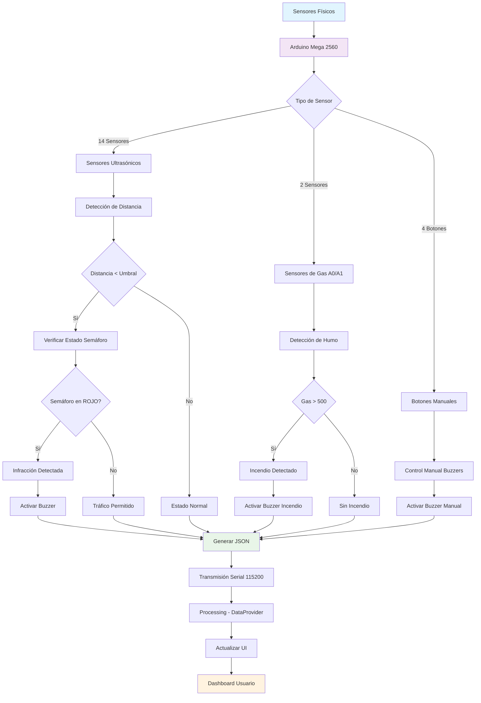
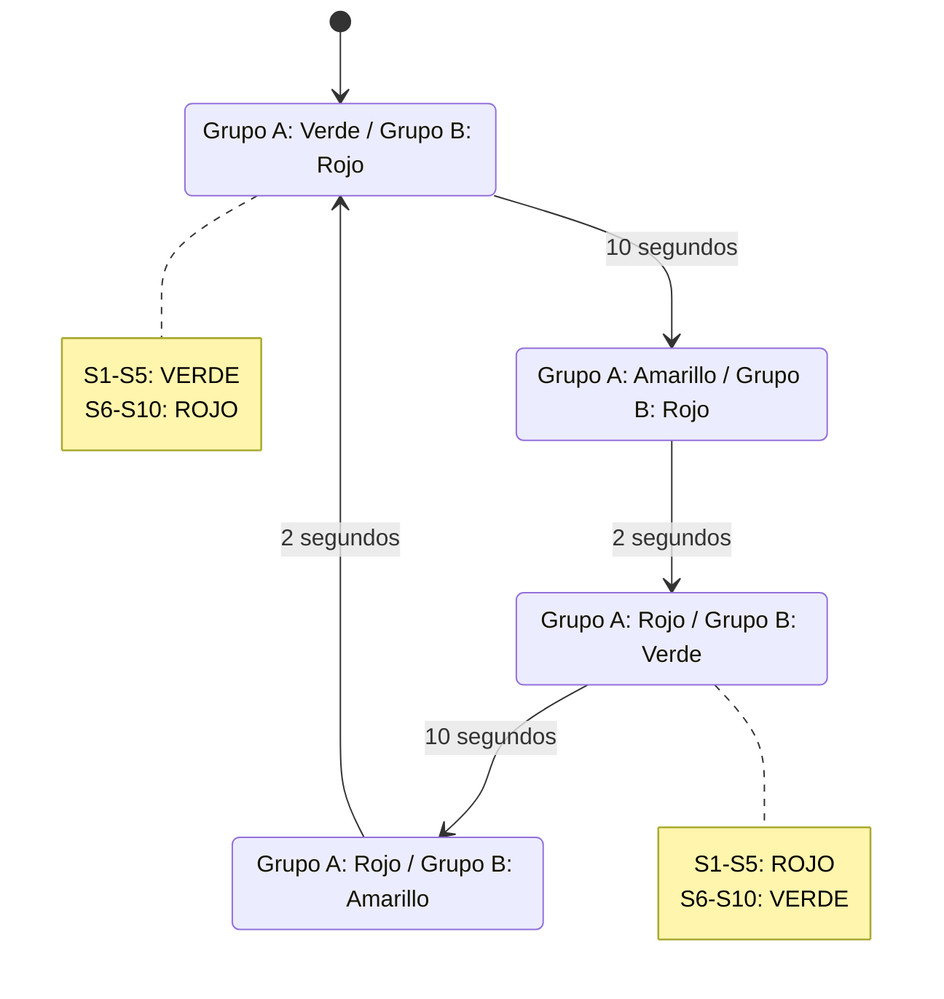
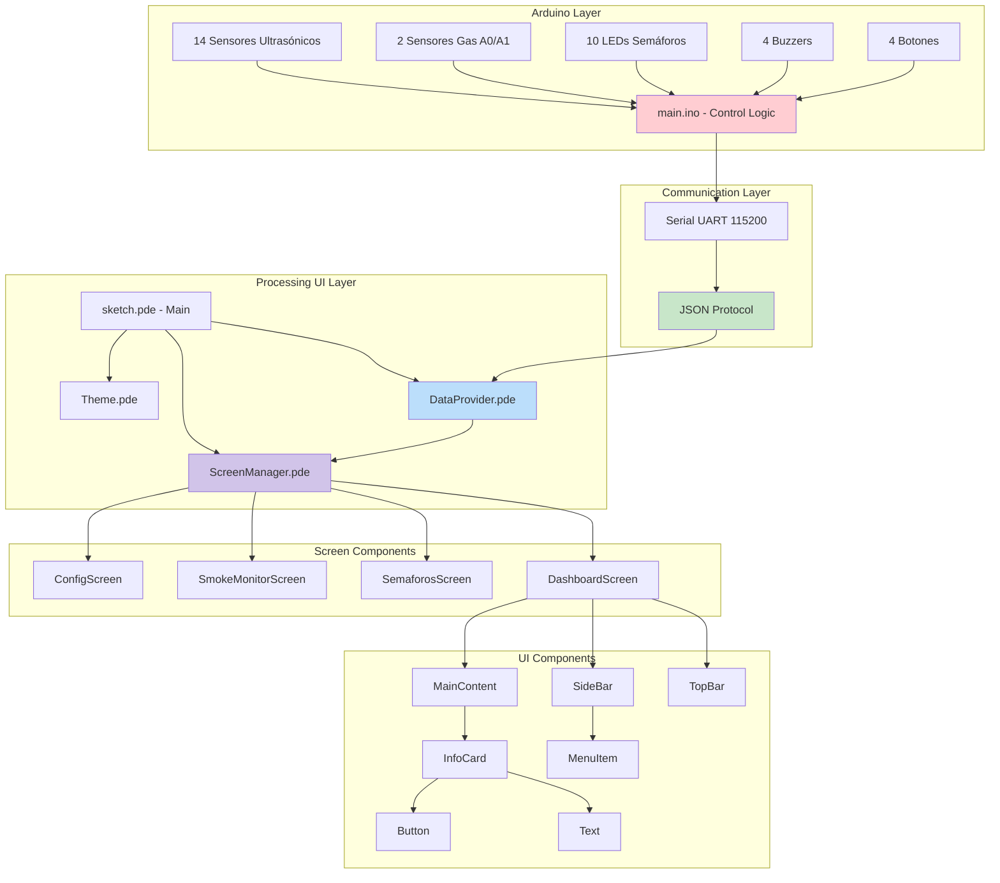
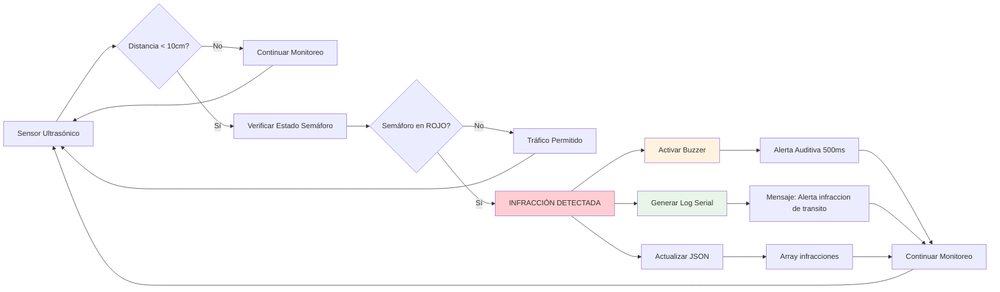
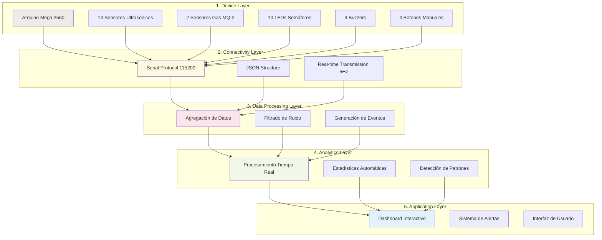
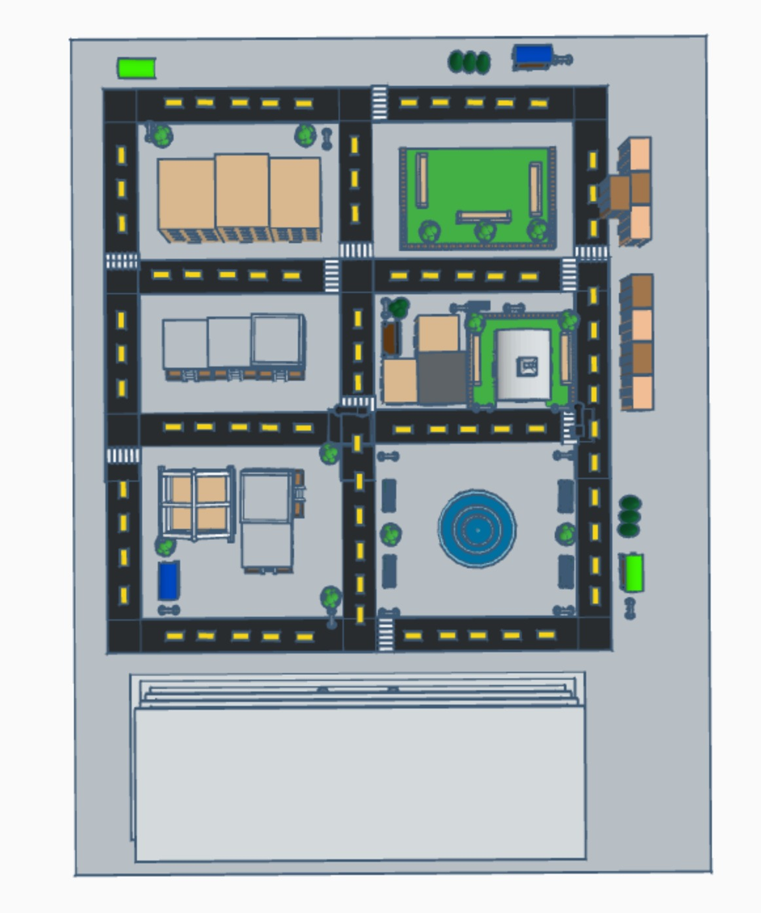
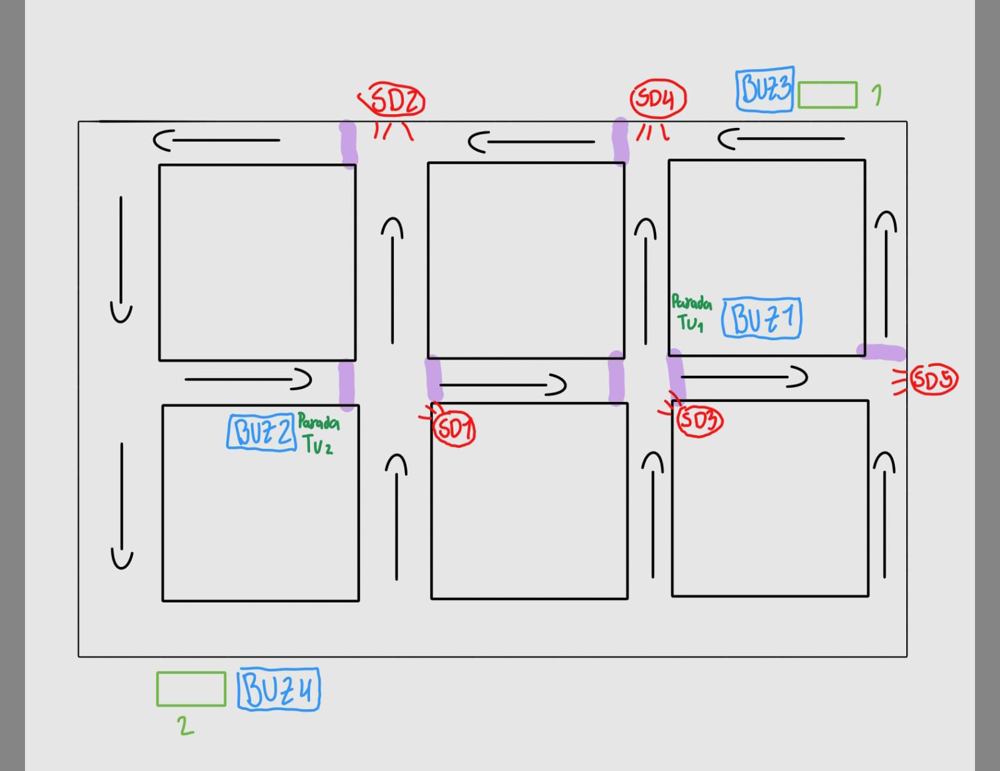
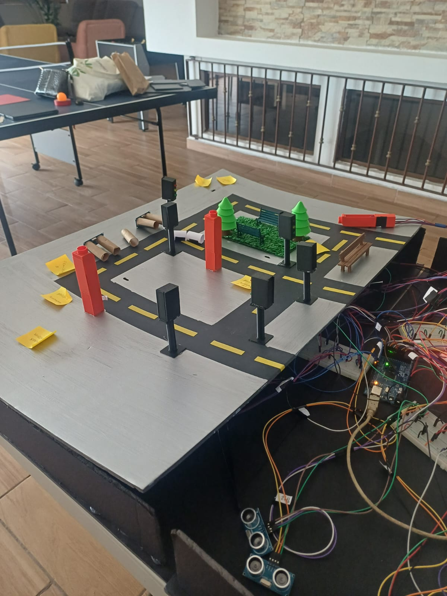
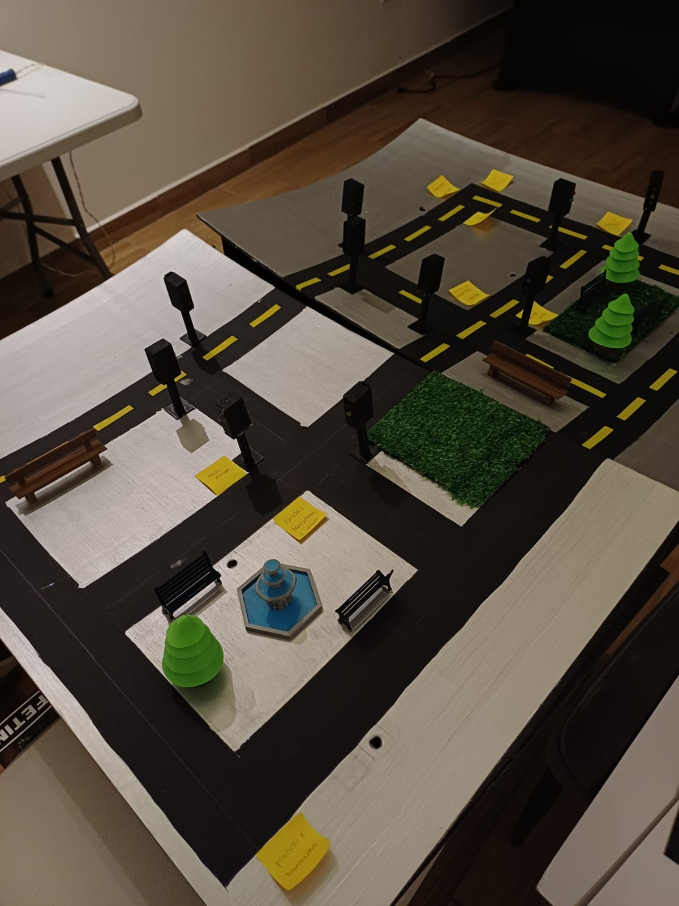
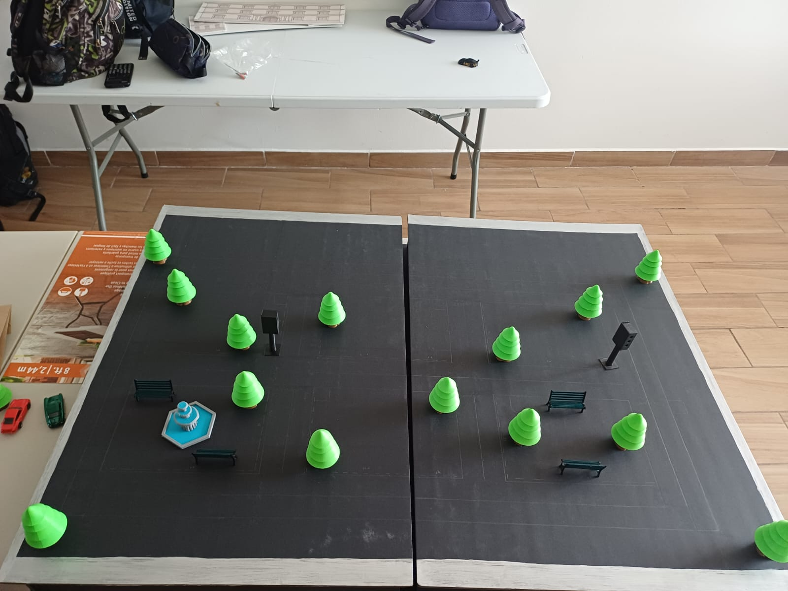

<div style="width: 100%; max-width: 700px; margin: 0 auto; padding: 48px 32px; font-family: 'Times New Roman', Times, serif;">
  <div style="text-align: center;">
    <h2 style="margin-bottom: 8px;">UNIVERSIDAD DE SAN CARLOS DE GUATEMALA</h2>
    <h3 style="margin-bottom: 8px;">FACULTAD DE INGENIERÍA</h3>
    <h4 style="margin-bottom: 8px;">ESCUELA DE INGENIERÍA DE CIENCIAS Y SISTEMAS</h4>
    <h4 style="margin-bottom: 8px;">LABORATORIO ARQUITECTURA DE COMPUTADORAS Y ENSAMBLADORES 2</h4>
    <h4 style="margin-bottom: 8px;">SECCIÓN B</h4>
    <h4 style="margin-bottom: 8px;">INGENIERO JURGEN RAMIREZ</h4>
    <h4 style="margin-bottom: 24px;">AUXILIAR LUIS LIZAMA</h4>
    <hr style="border: 1px solid #000; margin: 24px 0;">
    <h2 style="margin-bottom: 16px;"><ins>DOCUMENTACIÓN FASE 1</ins></h2>
    <h3 style="margin-bottom: 24px;">GRUPO #1</h3>
    <table style="width: 80%; margin: 0 auto; border-collapse: collapse; font-size: 1.1em;">
      <thead>
        <tr>
          <th style="padding: 8px;">Nombre</th>
          <th style="padding: 8px;">Carnet</th>
        </tr>
      </thead>
      <tbody>
        <tr><td style="padding: 8px;">DAMIAN OROZCO</td><td style="padding: 8px;">202300514</td></tr>
        <tr><td style="padding: 8px;">ESTEBAN TRAMPE</td><td style="padding: 8px;">202300431</td></tr>
        <tr><td style="padding: 8px;">JORGE MEJÍA</td><td style="padding: 8px;">202300376</td></tr>
        <tr><td style="padding: 8px;">FATIMA CEREZO</td><td style="padding: 8px;">202300434</td></tr>
        <tr><td style="padding: 8px;">VALERY ALARCÓN</td><td style="padding: 8px;">202300794</td></tr>
        <tr><td style="padding: 8px;">DIEGO MORALES</td><td style="padding: 8px;">202300449</td></tr>
        <tr><td style="padding: 8px;">JULIO ESCOBAR</td><td style="padding: 8px;">202300825</td></tr>
        <tr><td style="padding: 8px;">MARCOS BARRIOS</td><td style="padding: 8px;">202300396</td></tr>
      </tbody>
    </table>
  </div>
</div>

<div style="page-break-before: always;"></div>


## Introducción
En el contexto de las ciudades inteligentes modernas, la gestión eficiente del tráfico urbano y la seguridad ciudadana representan desafíos críticos que requieren soluciones tecnológicas innovadoras. Este proyecto desarrolla un *Sistema Inteligente de Seguridad y Gestión de Tráfico Urbano* basado en el Internet de las Cosas (IoT), que integra múltiples tecnologías para crear una infraestructura urbana conectada y automatizada.

El sistema implementa una arquitectura completa del *Smart Connected Design Framework*, combinando hardware Arduino Mega 2560 con sensores ultrasónicos HC-SR04, sensores de gas MQ-2, y un piezo electrico como sensor de sismos, junto con una interfaz gráfica interactiva desarrollada en Processing. Esta solución permite el monitoreo en tiempo real de intersecciones vehiculares, la detección automática de infracciones de tráfico, el control inteligente de semáforos, y la supervisión ambiental para detección temprana de incendios.

La propuesta se distingue por su capacidad de procesar múltiples fuentes de datos simultáneamente, generar alertas automáticas ante situaciones críticas, y proporcionar una visualización integral del estado del sistema a través de un dashboard interactivo. El proyecto demuestra la aplicación práctica de conceptos avanzados de arquitectura de computadoras, sistemas embebidos, y comunicación serial en un entorno de ciudad inteligente.

## Objetivos

### 1. General
Desarrollar e implementar un sistema IoT integral para la gestión automatizada del tráfico urbano y monitoreo de seguridad ciudadana, utilizando tecnologías de sensores distribuidos, procesamiento en tiempo real y interfaces de usuario intuitivas, que permita optimizar el flujo vehicular, detectar infracciones de tráfico automáticamente y proporcionar alertas tempranas ante situaciones de emergencia.

### 2. Específicos
- *Diseñar y construir una red de sensores distribuidos* que permita el monitoreo simultáneo de hasta 14 puntos críticos de tráfico utilizando sensores ultrasónicos HC-SR04, con capacidad de detectar presencia vehicular y medir distancias con precisión centimétrica para identificar violaciones a la señalización vial.

- *Implementar un sistema de comunicación y procesamiento de datos en tiempo real* basado en protocolo serial JSON a 115200 baudios, que integre el hardware Arduino con una interfaz gráfica en Processing, permitiendo la visualización instantánea de estadísticas de tráfico, alertas de seguridad y control centralizado de la infraestructura semafórica urbana.

## Descripción del Problema 

Las ciudades modernas enfrentan desafíos críticos en la gestión del tráfico urbano y la seguridad ciudadana que requieren soluciones automatizadas e inteligentes:

*Problemas de Tráfico:*
- Infracciones frecuentes de conductores que cruzan intersecciones en luz roja
- Falta de monitoreo automatizado en múltiples puntos de control simultáneamente
- Ausencia de sistemas de alertas inmediatas ante violaciones de tráfico
- Gestión manual e ineficiente de ciclos semafóricos

*Problemas de Seguridad:*
- Detección tardía de incendios o emergencias ambientales en espacios urbanos
- Carencia de sistemas integrados que combinen múltiples tipos de sensores
- Falta de centralización de alertas de emergencia en tiempo real

*Limitaciones Tecnológicas Actuales:*
- Sistemas de monitoreo fragmentados que no se comunican entre sí
- Interfaces de usuario complejas que dificultan la supervisión integral
- Altos costos de implementación de soluciones comerciales especializadas

Este proyecto aborda estas problemáticas mediante un sistema IoT integral que automatiza la detección de infracciones, centraliza el monitoreo de seguridad, y proporciona una interfaz unificada para la gestión urbana inteligente.

## Smart Connected Design Framework

Este proyecto implementa múltiples capas del Smart Connected Design Framework, creando un ecosistema IoT robusto y escalable.

### Capas Implementadas

#### 1. Dispositivos y Sensores (Device Layer)
- *Hardware:* Arduino con múltiples sensores y actuadores
- *Sensores Ultrasónicos:* 14 sensores para detectar presencia vehicular y peatonal
- *Sensores de Gas:* 2 sensores analógicos (A0, A1) para detección de humo/incendios
- *Actuadores:* 10 semáforos LED, 4 buzzers para alertas auditivas
- *Interfaces de Usuario:* Botones manuales para control directo de buzzers

#### 2. Conectividad (Connectivity Layer)
- *Protocolo Serial:* Comunicación a 115200 baudios entre Arduino y Processing
- *Formato de Datos:* JSON estructurado para intercambio de información
- *Transmisión en Tiempo Real:* Envío de datos cada 200ms (5 Hz)

#### 3. Procesamiento de Datos (Data Processing Layer)
- *Agregación de Datos:* El Arduino procesa múltiples fuentes de sensores
- *Filtrado de Ruido:* Implementación de umbrales y temporizadores para estabilizar lecturas
- *Generación de Eventos:* Detección automática de infracciones y situaciones de emergencia

#### 4. Análisis y Analytics (Analytics Layer)
- *Procesamiento en Tiempo Real:* La interfaz Processing analiza datos entrantes
- *Estadísticas Automáticas:* Cálculo de métricas como promedio de gas, conteo de infracciones
- *Detección de Patrones:* Identificación de zonas de alta actividad

#### 5. Aplicaciones y Servicios (Application Layer)
- *Dashboard Interactivo:* Visualización en tiempo real del estado del sistema
- *Sistema de Alertas:* Notificaciones visuales y auditivas para situaciones críticas
- *Interfaz de Usuario:* Navegación entre múltiples vistas especializadas

## Arquitectura del Sistema

### Arquitectura Física

[Sensores] → [Arduino] → [Serial] → [Processing] → [Dashboard]


### Arquitectura de Software

#### Módulo Arduino (main.ino)

Sensores → Procesamiento → Lógica de Negocio → Salida JSON


#### Módulo Processing (UI)

Serial Input → DataProvider → ScreenManager → Componentes UI


### Componentes Principales

#### Arduino
- *Gestión de Sensores:* Lectura y procesamiento de 14 sensores ultrasónicos
- *Control de Semáforos:* Lógica temporal para ciclos de semáforos (verde→amarillo→rojo)
- *Detección de Infracciones:* Monitoreo de violaciones en luz roja
- *Sistema de Alertas:* Activación automática de buzzers en emergencias
- *Comunicación Serial:* Envío de datos estructurados en JSON

#### Processing (Interfaz Gráfica)
- *DataProvider:* Gestor de datos con modo simulado y modo serial
- *ScreenManager:* Sistema de navegación entre pantallas
- *ComponenteUI:* Arquitectura modular basada en Atomic Design
  - Átomos: Text, Button
  - Moléculas: MenuItem, InfoCard
  - Organismos: TopBar, SideBar, ContentArea
  - Plantillas: Screen (clase base)
  - Páginas: DashboardScreen, SemaforosScreen, etc.

## Estructura de Carpetas

```
ARQUI2B_2S2025_GL4/
├── README.md                    # Documentación principal
├── arduino/
│   └── main.ino                # Firmware Arduino
└── ui/                         # Interfaz Processing
    ├── sketch.pde              # Punto de entrada
    ├── ui.pde                  # Configuración inicial
    ├── DataProvider.pde        # Gestión de datos
    ├── ScreenManager.pde       # Navegación de pantallas
    ├── Screen.pde              # Clase base para pantallas
    ├── DashboardScreen.pde     # Pantalla principal
    ├── SemaforosScreen.pde     # Vista de semáforos
    ├── SmokeMonitorScreen.pde  # Monitor de humo
    ├── ConfigScreen.pde        # Configuración
    ├── TopBar.pde              # Barra superior
    ├── SideBar.pde             # Barra lateral
    ├── MainContent.pde         # Área principal
    ├── ContentArea.pde         # Contenedor modular
    ├── MenuItem.pde            # Elemento de menú
    ├── Text.pde                # Componente de texto
    ├── Button.pde              # Componente de botón
    ├── InfoCard.pde            # Tarjeta informativa
    ├── Theme.pde               # Sistema de estilos
    ├── Interfaces.pde          # Interfaces para componentes
    ├── DrawUtils.pde           # Utilidades de dibujo
    └── build/                  # Archivos compilados
```

## Diagramas de Flujo

### Flujo Principal del Sistema




### Flujo de Control de Semáforos



### Arquitectura de Componentes



### Flujo de Detección de Infracciones



### Flujo de Smart Connected Design Framework



## Formato de Comunicación JSON

### Estructura de Datos

```json
{
  "ts": "timestamp ISO",
  "semaforos": {
    "S1-S10": "ROJO|VERDE|AMARILLO"
  },
  "dist_cm": {
    "P1-P6": "distancia_en_cm"
  },
  "gas_ppm": {
    "Z1-Z3": "nivel_gas_ppm"
  },
  "panico": {
    "Z1-Z3": "0|1"
  },
  "infracciones": ["P1", "P3", ...]
}
```

## Configuración de Hardware

### Sensores Ultrasónicos (14 unidades)
- *TM1, TM2:* Paradas Transmetro (pines 22-25)
- *TU1-TU7:* Red Transurbano (pines 26-35, algunos anulados)
- *TV2-TV7:* Red TV (pines 46-53, distribuidos)

### Sensores de Gas
- *A0:* Zona 1 de detección de humo
- *A1:* Zona 2 de detección de humo
- *Umbral:* 500 (escala 0-1023)

### Sistema de Semáforos
- *Grupo A:* Semáforos S1-S5 (pines 40-42)
- *Grupo B:* Semáforos S6-S10 (pines 43-45)
- *Temporización:* Verde 10s, Amarillo 2s

### Sistema de Alertas
- *Buzzer 1:* Pin 36 (control por TU1, botón D38)
- *Buzzer 2:* Pin 37 (control por TU2, botón D39)
- *Buzzer 3:* Pin 2 (control por incendio A0, botón D4)
- *Buzzer 4:* Pin 3 (control por incendio A1, botón D5)

## Funcionalidades del Sistema

### Monitoreo en Tiempo Real
- Estado de 10 semáforos simultáneos
- Distancias de 6 paradas críticas
- Niveles de gas en 3 zonas
- Estados de pánico por zona

### Detección Automática
- *Infracciones de Tráfico:* Cruce en luz roja
- *Incendios:* Detección por umbral de humo
- *Presencia Vehicular:* Detección ultrasónica
- *Eventos de Pánico:* Activación manual/automática

### Sistema de Alertas
- *Visuales:* Cambio de colores en interfaz
- *Auditivas:* Activación automática de buzzers
- *Registro:* Log de eventos con timestamp

## Compilación y Ejecución

### Firmware Arduino
1. Abrir arduino/main.ino en Arduino IDE
2. Configurar board: Arduino Mega 2560
3. Seleccionar puerto serial correspondiente
4. Compilar y cargar

### Interfaz Processing
bash
cd ui
processing-java --sketch=. --run


### Configuración Serial
- *Velocidad:* 115200 baudios
- *Formato:* 8N1 (8 bits, sin paridad, 1 bit stop)
- *Control de Flujo:* Ninguno

## Extensibilidad

### Agregar Nuevos Sensores
1. Definir pines en array US_PINS
2. Agregar lógica en función readUltrasonicCm()
3. Incluir en JSON de salida
4. Actualizar interfaz Processing

### Nuevas Pantallas UI
1. Crear clase heredando de Screen
2. Implementar método renderContent()
3. Registrar en ScreenManager
4. Agregar elemento en SideBar

### Protocolos Adicionales
- Preparado para WiFi/Ethernet
- Estructura JSON extensible
- Interfaz modular para nuevos protocolos

## Casos de Uso

### Gestión de Tráfico
- Monitoreo de flujo vehicular
- Detección automática de infracciones
- Optimización de tiempos de semáforo

### Seguridad Urbana
- Detección temprana de incendios
- Sistema de alertas en tiempo real
- Monitoreo de zonas críticas

### Análisis de Datos
- Estadísticas de tráfico
- Patrones de comportamiento
- Reportes de incidencias

## Tecnologías Utilizadas

- *Hardware:* Arduino Mega 2560
- *Sensores:* HC-SR04 (ultrasónicos), MQ-2 (gas)
- *Software:* Arduino IDE, Processing 4
- *Protocolos:* Serial UART, JSON
- *Arquitectura:* Smart Connected Design Framework
- *Patrones:* Atomic Design, Observer, Strategy

Este sistema representa una implementación completa del paradigma IoT, integrando hardware, software, comunicaciones y análisis de datos en una solución cohesiva para gestión urbana inteligente.

## Prototipo
### Funciones 

El prototipo desarrollado consiste en un *modelo 3D de ciudad inteligente* que simula un entorno urbano completo con infraestructura de transporte, seguridad y servicios públicos integrados. Esta maqueta física representa una implementación escalable del sistema IoT diseñado.

#### Características del Modelo 3D

*Infraestructura Urbana:*
- *6 cuadras urbanas* distribuidas estratégicamente para simular una ciudad compacta
- *10 semáforos* ubicados en intersecciones críticas para control de tráfico vehicular
- *Edificios, parques y fuentes* que recrean el ambiente de una ciudad real
- *1 iglesia* como punto de referencia arquitectónico y cultural
- *1 centro histórico* representando la zona patrimonial de la ciudad

*Sistema de Transporte Público:*
- *4 paradas de buses* distribuidas en puntos estratégicos de la ciudad
- *2 paradas de Transmetro* que forman parte del sistema de transporte masivo
- *2 paradas de Transurbano* integradas al sistema de movilidad urbana

*Rutas de Transporte:*
- *Transmetro:* Realiza un recorrido circular completo alrededor de toda la ciudad, conectando todas las zonas urbanas en un circuito cerrado que permite acceso integral a todos los sectores
- *Transurbano:* Opera únicamente en una calle principal de doble vía, proporcionando servicio de transporte rápido en línea recta entre dos puntos específicos de la ciudad

*Sistemas de Seguridad y Monitoreo:*
- *4 botones de pánico* distribuidos en zonas de alta afluencia para emergencias ciudadanas
- *2 sensores de incendio* ubicados en áreas críticas para detección temprana de incendios
- *1 sensor de sismos* instalado para monitoreo de actividad sísmica y alertas tempranas

*Integración Tecnológica:*
El modelo 3D no solo es una representación física, sino que integra todos los componentes electrónicos del sistema IoT, permitiendo la demostración en tiempo real de:
- Detección automática de infracciones de tráfico
- Monitoreo ambiental continuo
- Sistema de alertas de emergencia
- Control inteligente de semáforos
- Gestión centralizada desde la interfaz gráfica

Esta maqueta representa una *ciudad inteligente funcional* que demuestra la aplicabilidad práctica de tecnologías IoT en la gestión urbana moderna, sirviendo como prototipo escalable para implementaciones reales en entornos metropolitanos.

### Bocetos

A continuación se presentan los bocetos y modelos 3D del sistema desarrollado:

#### Boceto 1: Diseño General del Sistema




#### Boceto 2: Posicion de Componentes


## Armado Fisico De Maqueta y Conexiones 
#### Trabajo fisico elaborado por todos los integrantes del grupo 








## Registro De Aportes Semanales 

### Semana 1

<table style="width:100%; border-collapse:collapse;">
  <thead style="background:#f2f2f2;">
    <tr>
      <th style="border:1px solid #ccc; padding:8px; text-align:left;">Estudiante</th>
      <th style="border:1px solid #ccc; padding:8px; text-align:left;">Aporte</th>
    </tr>
  </thead>
  <tbody>
    <tr><td style="border:1px solid #ccc; padding:8px;">Valery Alarcon</td><td style="border:1px solid #ccc; padding:8px;">Diseño de la maqueta fisica</td></tr>
    <tr><td style="border:1px solid #ccc; padding:8px;">Esteban Chacón</td><td style="border:1px solid #ccc; padding:8px;">Diseño base de semaforos (Processing)</td></tr>
    <tr><td style="border:1px solid #ccc; padding:8px;">Julio Escobar</td><td style="border:1px solid #ccc; padding:8px;">Conexión inicial del arduino</td></tr>
    <tr><td style="border:1px solid #ccc; padding:8px;">Damián Orozco</td><td style="border:1px solid #ccc; padding:8px;">Diseño base de solución para infraccion en los semaforos</td></tr>
    <tr><td style="border:1px solid #ccc; padding:8px;">Marcos Barrios</td><td style="border:1px solid #ccc; padding:8px;">Diseño3D tinkercad</td></tr>
    <tr><td style="border:1px solid #ccc; padding:8px;">Jorge Mejía</td><td style="border:1px solid #ccc; padding:8px;">Organización del equipo y Diseño base en processing</td></tr>
    <tr><td style="border:1px solid #ccc; padding:8px;">Diego Morales</td><td style="border:1px solid #ccc; padding:8px;">Conexion inicial del arduino</td></tr>
    <tr><td style="border:1px solid #ccc; padding:8px;">Fátima Cerezo</td><td style="border:1px solid #ccc; padding:8px;">Diseño base de distancias de buses a las paradas (Processing)</td></tr>
  </tbody>
</table>

### Semana 2

<table style="width:100%; border-collapse:collapse;">
  <thead style="background:#f2f2f2;">
    <tr>
      <th style="border:1px solid #ccc; padding:8px; text-align:left;">Estudiante</th>
      <th style="border:1px solid #ccc; padding:8px; text-align:left;">Aporte</th>
    </tr>
  </thead>
  <tbody>
    <tr>
      <td style="border:1px solid #ccc; padding:8px;">Valery Alarcon</td>
      <td style="border:1px solid #ccc; padding:8px;" rowspan="4">Armado de la maqueta física, conexión física del arduino a los sensores y semáforos, desarrollo de código en arduino</td>
    </tr>
    <tr><td style="border:1px solid #ccc; padding:8px;">Julio Escobar</td></tr>
    <tr><td style="border:1px solid #ccc; padding:8px;">Damián Orozco</td></tr>
    <tr><td style="border:1px solid #ccc; padding:8px;">Diego Morales</td></tr>
    <tr>
      <td style="border:1px solid #ccc; padding:8px;">Esteban Chacón</td>
      <td style="border:1px solid #ccc; padding:8px;" rowspan="4">Armado de la maqueta física, conexión física del arduino a los sensores y semáforos, desarrollo de código para el dashboard en processing</td>
    </tr>
    <tr><td style="border:1px solid #ccc; padding:8px;">Marcos Barrios</td></tr>
    <tr><td style="border:1px solid #ccc; padding:8px;">Jorge Mejía</td></tr>
    <tr><td style="border:1px solid #ccc; padding:8px;">Fátima Cerezo</td></tr>
  </tbody>
</table>


### Semana 3

<table style="width:100%; border-collapse:collapse;">
  <thead style="background:#f2f2f2;">
    <tr>
      <th style="border:1px solid #ccc; padding:8px; text-align:left;">Estudiante</th>
      <th style="border:1px solid #ccc; padding:8px; text-align:left;">Aporte</th>
    </tr>
  </thead>
  <tbody>
    <tr>
      <td style="border:1px solid #ccc; padding:8px;">Valery Alarcon</td>
      <td style="border:1px solid #ccc; padding:8px;" rowspan="2">Documentacion y detalles fisicos en la maqueta</td>
    </tr>
    <tr>
      <td style="border:1px solid #ccc; padding:8px;">Fátima Cerezo</td>
    </tr>
    <tr>
      <td style="border:1px solid #ccc; padding:8px;">Esteban Chacón</td>
      <td style="border:1px solid #ccc; padding:8px;">Correccion de errores en processing</td>
    </tr>
    <tr>
      <td style="border:1px solid #ccc; padding:8px;">Julio Escobar</td>
      <td style="border:1px solid #ccc; padding:8px;" rowspan="4">Correccion de errores en cableado fisico y codigo del arduino</td>
    </tr>
    <tr>
      <td style="border:1px solid #ccc; padding:8px;">Damián Orozco</td>
    </tr>
    <tr>
      <td style="border:1px solid #ccc; padding:8px;">Marcos Barrios</td>
    </tr>
    <tr>
      <td style="border:1px solid #ccc; padding:8px;">Diego Morales</td>
    </tr>
    <tr>
      <td style="border:1px solid #ccc; padding:8px;">Jorge Mejía</td>
      <td style="border:1px solid #ccc; padding:8px;">Comunicacion serial</td>
    </tr>
  </tbody>
</table>

## Costo Total

| Componente | Precio Total (Q) |
|------------|----------|
| Arduino Mega 2560 | 350.00 |
| Sensores y Componentes| 495,25 |
| Maqueta | 559.00 |
| Cable y Jumpers| 270.00 |
| Impresiones 3D | 314.45 |
| *TOTAL* | *Q 1,988.70* |

## Conclusiones

El desarrollo de este *Sistema Inteligente de Seguridad y Gestión de Tráfico Urbano* ha representado una experiencia académica y técnica enriquecedora que nos ha permitido aplicar conceptos avanzados de arquitectura de computadoras, sistemas embebidos y tecnologías IoT en un contexto práctico y realista.

### Aprendizaje Tecnológico

La implementación de este proyecto nos brindó la oportunidad de *explorar y dominar nuevas tecnologías* que son fundamentales en el paradigma de las ciudades inteligentes. El trabajo con el *Smart Connected Design Framework* nos permitió comprender la complejidad de los sistemas IoT multicapa, desde la gestión de sensores hasta la implementación de interfaces de usuario interactivas. La integración de *Arduino con Processing* mediante comunicación serial JSON nos introdujo a protocolos de comunicación en tiempo real que son esenciales en aplicaciones industriales modernas.

### Desafíos Técnicos Enfrentados

Uno de los principales retos durante el desarrollo fue la *alta sensibilidad ambiental de los sensores ultrasónicos HC-SR04*. Estos componentes resultaron ser extremadamente susceptibles a variaciones de temperatura, humedad, y interferencias electromagnéticas del entorno. Fue necesario implementar algoritmos de filtrado de ruido, establecer umbrales dinámicos, y desarrollar lógica de estabilización para obtener lecturas confiables. Esta experiencia nos enseñó la importancia del acondicionamiento de señales y la validación de datos en sistemas embebidos reales.

### Importancia del Trabajo Colaborativo

La *naturaleza multidisciplinaria del proyecto* hizo evidente que su éxito dependía fundamentalmente del trabajo en equipo. La integración simultánea de hardware, firmware, interfaces gráficas, protocolos de comunicación, y documentación técnica requirió la distribución estratégica de responsabilidades entre los ocho integrantes del grupo. Esta metodología colaborativa nos permitió abordar eficientemente todas las necesidades del sistema, desde el diseño electrónico hasta la implementación de patrones de diseño avanzados como Atomic Design.

### Enfoque Realista y Aplicabilidad

Durante todo el proceso de desarrollo, *priorizamos la creación de una solución realista* que pudiera implementarse efectivamente en un entorno urbano real. Esto se reflejó en la selección de componentes comercialmente disponibles, la implementación de protocolos estándar de la industria, y el diseño de una arquitectura escalable. El sistema resultante no es meramente un prototipo académico, sino una propuesta viable para la gestión inteligente de infraestructura urbana.

### Impacto y Proyección

El proyecto demuestra exitosamente cómo la *convergencia de múltiples tecnologías* puede crear soluciones integrales para problemas urbanos complejos. La implementación de detección automática de infracciones, monitoreo ambiental, y interfaces de usuario intuitivas establece las bases para futuras extensiones hacia sistemas más complejos que podrían incluir inteligencia artificial, conectividad inalámbrica, y análisis predictivo.

### Reflexión Final

Esta experiencia nos ha preparado para enfrentar los *desafíos tecnológicos del futuro*, proporcionándonos no solo conocimientos técnicos específicos, sino también la capacidad de integrar múltiples dominios tecnológicos en soluciones cohesivas. El proyecto representa un ejemplo práctico de cómo la ingeniería de sistemas puede contribuir al desarrollo de ciudades más inteligentes, seguras y eficientes.