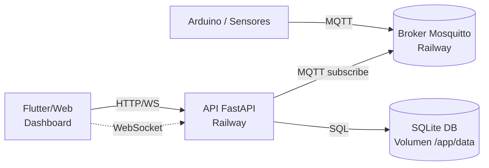
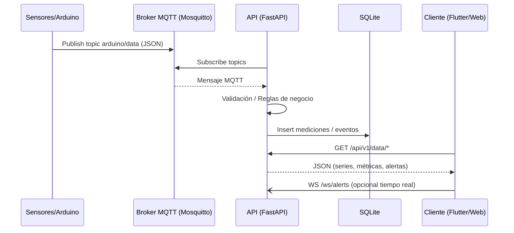
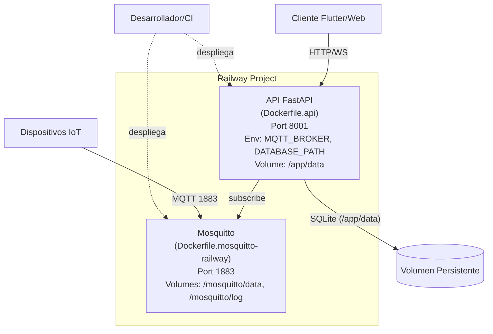
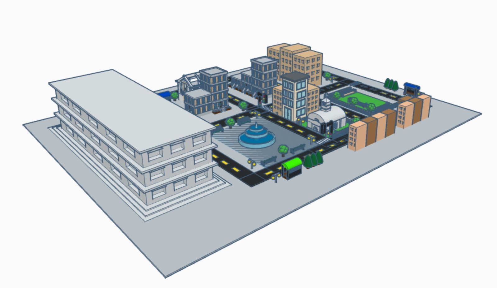
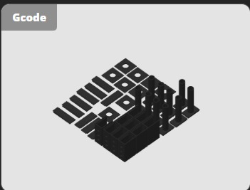
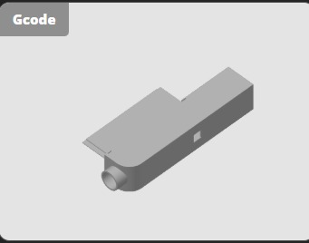
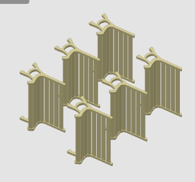
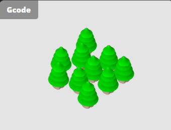
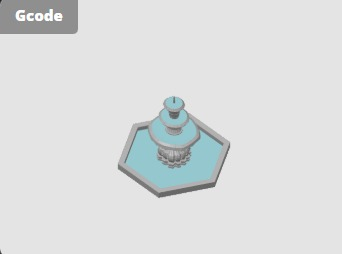

<div style="width: 100%; max-width: 700px; margin: 0 auto; padding: 48px 32px; font-family: 'Times New Roman', Times, serif;">
  <div style="text-align: center;">
    <h2 style="margin-bottom: 8px;">UNIVERSIDAD DE SAN CARLOS DE GUATEMALA</h2>
    <h3 style="margin-bottom: 8px;">FACULTAD DE INGENIERÍA</h3>
    <h4 style="margin-bottom: 8px;">ESCUELA DE INGENIERÍA DE CIENCIAS Y SISTEMAS</h4>
    <h4 style="margin-bottom: 8px;">LABORATORIO ARQUITECTURA DE COMPUTADORAS Y ENSAMBLADORES 2</h4>
    <h4 style="margin-bottom: 8px;">SECCIÓN B</h4>
    <h4 style="margin-bottom: 8px;">INGENIERO JURGEN RAMIREZ</h4>
    <h4 style="margin-bottom: 24px;">AUXILIAR LUIS LIZAMA</h4>
    <hr style="border: 1px solid #000; margin: 24px 0;">
    <h2 style="margin-bottom: 16px;"><ins>DOCUMENTACIÓN FASE 2</ins></h2>
    <h3 style="margin-bottom: 24px;">GRUPO #1</h3>
    <table style="width: 80%; margin: 0 auto; border-collapse: collapse; font-size: 1.1em;">
      <thead>
        <tr>
          <th style="padding: 8px;">Nombre</th>
          <th style="padding: 8px;">Carnet</th>
        </tr>
      </thead>
      <tbody>
        <tr><td style="padding: 8px;">DAMIAN OROZCO</td><td style="padding: 8px;">202300514</td></tr>
        <tr><td style="padding: 8px;">ESTEBAN TRAMPE</td><td style="padding: 8px;">202300431</td></tr>
        <tr><td style="padding: 8px;">JORGE MEJÍA</td><td style="padding: 8px;">202300376</td></tr>
        <tr><td style="padding: 8px;">FATIMA CEREZO</td><td style="padding: 8px;">202300434</td></tr>
        <tr><td style="padding: 8px;">VALERY ALARCÓN</td><td style="padding: 8px;">202300794</td></tr>
        <tr><td style="padding: 8px;">DIEGO MORALES</td><td style="padding: 8px;">202300449</td></tr>
        <tr><td style="padding: 8px;">JULIO ESCOBAR</td><td style="padding: 8px;">202300825</td></tr>
        <tr><td style="padding: 8px;">MARCOS BARRIOS</td><td style="padding: 8px;">202300396</td></tr>
      </tbody>
    </table>
  </div>
</div>

<div style="page-break-before: always;"></div>


## Introducción
La Fase 2 del proyecto *Sistema Inteligente de Seguridad y Gestión de Tráfico Urbano: Cimentación y Monitoreo Local* se centra en la evolución de un sistema de monitoreo inicial hacia una arquitectura integral basada en el Internet de las Cosas (IoT) y la Inteligencia Artificial (IA). En esta etapa, la Raspberry Pi se consolida como nodo central de comunicación, gestionando la transmisión, persistencia y visualización de datos recolectados por microcontroladores Arduino y procesados mediante protocolos de comunicación estandarizados.
El objetivo es garantizar una infraestructura robusta, conectada y escalable que permita optimizar la movilidad urbana, fortalecer la seguridad ciudadana y ofrecer información en tiempo real a los usuarios a través de una aplicación móvil multiplataforma. Esta fase representa un paso fundamental en la construcción de soluciones tecnológicas innovadoras que integran hardware, software y servicios digitales aplicados al contexto de una ciudad inteligente.

## Objetivos

### 1. General
Diseñar e implementar un sistema IoT robusto y escalable que integre hardware, software y servicios digitales para la gestión de tráfico y seguridad urbana, consolidando la Raspberry Pi como nodo central de comunicación, almacenamiento y visualización de datos en tiempo real.

### 2. Específicos
- *Desarrollar la integración entre Arduino y Raspberry Pi* mediante protocolos de comunicación confiables (ej. MQTT) para garantizar la transmisión y procesamiento de datos en tiempo real.

- *Implementar una base de datos y una API RESTful* que permitan la persistencia de eventos, el análisis histórico y el acceso seguro a la información recolectada.

- *Diseñar e implementar una aplicación móvil multiplataforma en Flutter* que funcione como interfaz de usuario, mostrando el estado del tráfico, alertas de seguridad y la ubicación simulada del transporte público.

## Descripción del Problema 

En zonas urbanas de alta densidad, como el Centro Histórico de la Ciudad de Guatemala, la movilidad vehicular deficiente y la falta de sistemas de vigilancia eficientes generan congestión, retrasos y riesgos para la seguridad ciudadana. La ausencia de mecanismos de monitoreo en tiempo real limita la capacidad de respuesta ante emergencias como incendios, sismos o incidentes de seguridad, además de dificultar la detección de infracciones de tránsito.
Ante esta situación, surge la necesidad de implementar un sistema tecnológico integral que combine el Internet de las Cosas (IoT) y la Inteligencia Artificial (IA), con el fin de optimizar la gestión del tráfico, fortalecer la seguridad y proporcionar información oportuna y accesible a los ciudadanos mediante aplicaciones móviles.

## Smart Connected Design Framework

Este proyecto implementa múltiples capas del Smart Connected Design Framework, creando un ecosistema IoT robusto y escalable.

### Capas del Smart Connected Design Framework

1) Dispositivo / Edge (Things)
- Responsabilidad: adquisición de datos y generación de eventos.
- Componentes: sensores MQ-2 (gas), acelerómetro/sensor sísmico, GPS, botón de pánico, semaforización.
- Controlador: Arduino publica mediciones vía MQTT.
- Formato de salida: JSON compacto con `ts` (UTC), ejemplo `{ "gas_ppm": 25.3 }`.
- KPIs: tasa de muestreo, pérdida de paquetes, estabilidad de alimentación.

2) Conectividad
- Protocolo: MQTT (QoS 0 para telemetría rápida, QoS 1 para alertas críticas).
- Broker: Eclipse Mosquitto desplegado en Railway.
- Tópicos estándar:
  - `arduino/data` (telemetría consolidada)
  - `iot/bus/<code>` (posiciones/estado de buses)
  - `iot/sensor/<name>` (sensor específico)
- KPIs: latencia pub/sub, mensajes por segundo, sesiones activas.

3) Ingesta y Mensajería
- Suscripción desde la API al broker (handler MQTT).
- Validación de payloads y roteo por tópico.
- Control de flujo: límites de lote y tamaño de mensajes.
- KPIs: mensajes procesados/minuto, errores de parseo, reintentos.

4) Procesamiento / Back‑end
- Framework: FastAPI (`api/main.py`, `api/mqtt_handler.py`).
- Reglas de negocio y normalización (`api/database.py`).
- Exposición de consultas optimizadas (`api/data_endpoints.py`).
- KPIs: tiempo de proceso por evento, tasa de errores 5xx.

5) Persistencia de Datos
- Motor: SQLite; esquema en `SQL/DB_ARQUI2_SQLite.sql`.
- Tablas clave: `Bus`, `BusPosition`, `Alert`, `AlertType`, `TrafficInfraction`, `PanicEvent`, `SeismicEvent`, `GasEvent`, `GasMeasurement`, `SeismicMeasurement`.
- Índices para series temporales (por `ts`).
- KPIs: tamaño de DB, tiempo de consulta, fragmentación.

6) Exposición / Servicios
- REST: prefijo `/api/v1` (ver Endpoints clave).
- WebSocket: `/ws/stops`, `/ws/traffic`, `/ws/alerts` para tiempo real.
- CORS habilitado para clientes Flutter/Web.
- KPIs: latencia p95/p99, RPS, conexiones WS activas.

7) Presentación / Dashboard
- Cliente: Flutter (`seguridad_trafico/`) consume endpoints de dashboard/tablas.
- Funciones: gráficas de series (gas/sismo), estado de buses, alertas recientes, métricas.
- KPIs: FPS/UI, tiempos de carga, uso de datos.

8) Observabilidad y Operaciones
- Endpoints de soporte: `/api/v1/debug/*`.
- Logging configurable vía `LOG_LEVEL`.
- Posible integración futura: métricas Prometheus y trazas.
- KPIs: cobertura de logs, ruido de logs, alertas operativas.

9) Seguridad (líneas base)
- Credenciales MQTT por entorno y rotación periódica.
- Validación de payloads, límites de tamaño, sanitización.
- CORS restringido en producción a dominios conocidos.
- Opcional: TLS para MQTT/HTTP según requerimientos del entorno.

---

## Arquitectura del Sistema

### Arquitectura Física

[Sensores] → [Arduino] → [Raspberry Pi] → [MQTT Broker] → [API FastAPI] → [Flutter App]


### Arquitectura de Software

#### Módulo Arduino (main.ino)

Sensores → Procesamiento → Lógica de Negocio → Publicación MQTT


#### Módulo Raspberry Pi (Gateway IoT)

MQTT Publisher → Data Aggregation → Cloud Communication → Local Processing


#### Módulo API (FastAPI)

MQTT Subscriber → Database Storage → REST Endpoints → WebSocket Real-time


#### Módulo Flutter (Mobile App)

HTTP Client → State Management → UI Components → Real-time Updates


### Componentes Principales

#### Arduino (Edge Device)
- *Gestión de Sensores:* Lectura y procesamiento de sensores ultrasónicos y MQ-2
- *Control de Semáforos:* Lógica temporal para ciclos de semáforos inteligentes
- *Detección de Infracciones:* Monitoreo de violaciones en tiempo real
- *Sistema de Alertas:* Activación automática de buzzers y notificaciones
- *Comunicación IoT:* Publicación de datos vía MQTT con formato JSON

#### Raspberry Pi (IoT Gateway)
- *Agregación de Datos:* Consolidación de múltiples fuentes de sensores
- *Comunicación Cloud:* Retransmisión confiable hacia servicios en la nube
- *Procesamiento Local:* Análisis en tiempo real y filtrado de datos
- *Gestión de Conectividad:* Manejo de reconexiones y calidad de servicio

#### API FastAPI (Backend)
- *Procesamiento MQTT:* Suscripción y procesamiento de mensajes IoT
- *Persistencia:* Almacenamiento estructurado en base de datos SQLite
- *Exposición REST:* Endpoints para consultas históricas y métricas
- *WebSockets:* Comunicación en tiempo real con aplicaciones cliente

#### Flutter App (Frontend)
- *Interfaz Responsiva:* Diseño adaptativo para múltiples dispositivos
- *Tiempo Real:* Actualizaciones instantáneas vía WebSockets
- *Mapas Interactivos:* Visualización geoespacial de elementos urbanos
- *Notificaciones:* Sistema de alertas push integrado

## Arquitectura en Railway

- Servicios
  - Broker Mosquitto: recibe publicaciones MQTT desde Arduino/Simulador.
  - API FastAPI: se suscribe al broker, procesa y expone datos.

- Red y DNS
  - Comunicación interna por hostname privado de Railway o variable `MQTT_BROKER` con servicio del broker.
  - Exposición pública del API por HTTP (dominio de Railway).

- Variables de Entorno (API)
  - SERVER_HOST=0.0.0.0
  - SERVER_PORT=8001
  - MQTT_BROKER=<mosquitto-host>
  - MQTT_PORT=1883
  - MQTT_USERNAME=<user>
  - MQTT_PASSWORD=<pass>
  - DATABASE_PATH=/app/data/ARQUI_2.db
  - LOG_LEVEL=INFO

- Variables de Entorno (Broker)
  - Configuración propia de Mosquitto (usuarios/acl si aplica).

- Persistencia
  - Volumen para SQLite en el contenedor del API: `/app/data`.
  - Volúmenes del broker para colas offline y logs (opcional).

- Escalado
  - API: escalar a más instancias si el tráfico HTTP/WS crece.
  - Broker: reservar suficiente RAM/CPU si crece el throughput MQTT.

---

## Endpoints Clave (REST)

- Base: `/api/v1`
- Estado/Debug: `/status`, `/debug/received`, `/debug/mqtt-test`, `/debug/database-stats`, `/debug/websocket-stats`.
- Datos:
  - `/data/bus-positions`, `/data/bus-positions/bus/1`, `/data/bus-positions/bus/2`
  - `/data/gas-history`, `/data/gas-history/origin/1`, `/data/gas-history/origin/2`
  - `/data/seismic-history`
  - Tablas: `/data/tables/traffic-infractions`, `/panic-events`, `/seismic-events`, `/gas-events`
- Dashboard:
  - `/data/dashboard/summary`
  - `/data/dashboard/charts/gas|seismic|bus-positions`
  - `/data/dashboard/alerts/recent`
  - `/data/dashboard/stats/hourly`
  - `/data/dashboard/buses/status`
  - `/data/dashboard/metrics`

## WebSockets
- `/ws/stops`, `/ws/traffic`, `/ws/alerts`

---

## Pasos de Despliegue en Railway (resumen)

1) Crear proyecto y dos servicios
- Broker: construir con `Dockerfile.mosquitto-railway`.
- API: construir con `Dockerfile.api`.

2) Configurar variables de entorno
- En API: `MQTT_BROKER` debe apuntar al hostname interno del broker en Railway.
- Configurar `MQTT_USERNAME/MQTT_PASSWORD` coherentes con el broker.

3) Volúmenes
- API: volumen para `/app/data` (persistir SQLite).
- Broker: volúmenes para `/mosquitto/data` y `/mosquitto/log` (opcional).

4) Healthchecks
- API: HTTP GET `/api/v1/status` debe responder 200.
- Broker: check TCP al puerto 1883.

5) Dominios
- Exponer la URL pública del API para Flutter.
- Broker típicamente solo interno; exponerlo solo si dispositivos externos publicarán directamente.

---

## Operación y Mantenimiento

- Monitoreo
  - Revisar `/api/v1/debug/*` para métricas rápidas.
  - Ajustar `LOG_LEVEL` según necesidad (INFO/DEBUG).

- Backup/Restore
  - Copiar el archivo SQLite desde `/app/data/ARQUI_2.db`.

- Seguridad
  - Rotar credenciales MQTT periódicamente.
  - Restringir CORS en producción a dominios de la app.


## Estructura de Carpetas

```
ARQUI2B_2S2025_GL4/
├── api
│   ├── _init_.py
│   ├── config.py
│   ├── data_endpoints.py
│   ├── database.py
│   ├── init_database.py
│   ├── insert_test_bus_data.py
│   ├── main.py
│   ├── mqtt_handler.py
│   ├── requirements.txt
│   ├── routes.py
│   ├── simulate_bus_data.py
│   ├── test_dashboard_endpoints.py
│   ├── test_mqtt_connection.py
│   ├── utils.py
│   └── websocket_manager.py
├── arduino
│   ├── main
│   │   └── main.ino
│   ├── pruebas_hcsr04.pdsprj
│   ├── skech_hcsr04
│   │   └── skech_hcsr04.ino
│   ├── sketch_ciudad_con_mq02
│   │   └── sketch_ciudad_con_mq02.ino
│   └── sketch_ciudad_con_sismo
│       └── sketch_ciudad_con_sismo.ino
├── docker-compose.yml
├── Dockerfile.api
├── Dockerfile.mosquitto
├── Dockerfile.mosquitto-railway
├── Dockerfile.mqtt
├── documentation
│   ├── Manual.md
│   └── Manual.pdf
├── init-db.py
├── mosquitto-railway.conf
├── mosquitto.conf
├── mqtt
│   ├── _init_.py
│   ├── arduino_data_parser.py
│   ├── arduino_mqtt_publisher.py
│   ├── config.py
│   ├── ejemplo_mensaje_mqtt.json
│   ├── main.py
│   ├── mqtt_config.py
│   ├── requirements.txt
│   ├── serial_receiver.py
│   ├── simulation_mode.py
│   ├── start_publisher.sh
│   ├── stop_publisher.sh
│   ├── test_mqtt.py
│   ├── test_ports.py
│   └── test_serial_raw.py
├── railway-mosquitto.json
├── railway.json
├── README.md
├── requirements.txt
├── seguridad_trafico
│   ├── analysis_options.yaml
│   ├── android
│   ├── assets
│   │   └── Map.svg
│   ├── ios
│   ├── lib
│   │   ├── data
│   │   ├── layouts
│   │   │   └── main_layout.dart
│   │   ├── main.dart
│   │   ├── models
│   │   │   ├── bus_stop.dart
│   │   │   ├── dashboard_models.dart
│   │   │   ├── traffic_light.dart
│   │   │   └── websocket_message.dart
│   │   ├── routes
│   │   │   └── app_router.dart
│   │   ├── screens
│   │   │   ├── dashboard_screen.dart
│   │   │   ├── home_screen.dart
│   │   │   ├── info_screen.dart
│   │   │   ├── intro_screen.dart
│   │   │   ├── map_screen.dart
│   │   │   ├── notifications_screen.dart
│   │   │   └── qr_scanner_screen.dart
│   │   ├── services
│   │   │   ├── bus_stop_service.dart
│   │   │   ├── bus_stop_websocket_service.dart
│   │   │   ├── dashboard_api_service.dart
│   │   │   ├── svg_traffic_service.dart
│   │   │   ├── websocket_alerts.dart
│   │   │   └── websocket_service.dart
│   │   └── widgets
│   │       ├── alert_feed.dart
│   │       ├── bus_stop_eta_widget.dart
│   │       ├── bus_stop_modal.dart
│   │       ├── dashboard_charts.dart
│   │       ├── eta_info_modal.dart
│   │       ├── map_container.dart
│   │       └── traffic_light_modal.dart
│   ├── linux
│   ├── macos
│   ├── pubspec.lock
│   ├── pubspec.yaml
│   ├── README.md
│   ├── seguridad_trafico.iml
│   ├── test
│   │   └── widget_test.dart
│   ├── web
│   │   ├── favicon.png
│   │   ├── icons
│   │   │   ├── Icon-192.png
│   │   │   ├── Icon-512.png
│   │   │   ├── Icon-maskable-192.png
│   │   │   └── Icon-maskable-512.png
│   │   ├── index.html
│   │   └── manifest.json
│   └── windows
│       ├── CMakeLists.txt
│       ├── flutter
│       │   ├── CMakeLists.txt
│       │   ├── ephemeral
│       │   ├── generated_plugin_registrant.cc
│       │   ├── generated_plugin_registrant.h
│       │   └── generated_plugins.cmake
│       └── runner
│           ├── CMakeLists.txt
│           ├── flutter_window.cpp
│           ├── flutter_window.h
│           ├── main.cpp
│           ├── resource.h
│           ├── resources
│           │   └── app_icon.ico
│           ├── runner.exe.manifest
│           ├── Runner.rc
│           ├── utils.cpp
│           ├── utils.h
│           ├── win32_window.cpp
│           └── win32_window.h
├── SQL
│   └── DB_ARQUI2_SQLite.sql
├── start-api.sh
└── test_infraction_mqtt.py
```

## Diagramas de Flujo

### Flujo del Sistema


### Flujo de Datos
```
Sensores → MQTT publish → Broker → API (subscribe) → Parseo/Reglas → SQLite → Endpoints
```



### Despliegue en Railway
```
Railway Project
├─ Service: mosquitto (Dockerfile.mosquitto-railway)
│  - Port: 1883
│  - Volume: /mosquitto/data, /mosquitto/log
│  - Healthcheck: TCP 1883
│
└─ Service: api (Dockerfile.api)
   - Port: 8001 (HTTP)
   - Env: MQTT_BROKER=<host_mosquitto>, MQTT_PORT=1883, MQTT_USER/PASS
   - Env: DATABASE_PATH=/app/data/ARQUI_2.db
   - Volume: /app/data
   - Healthcheck: GET /api/v1/status
```



---

## Configuración de Hardware

### Sensores Ultrasónicos (14 unidades)
- *TM1, TM2:* Paradas Transmetro (pines 22-25)
- *TU1-TU7:* Red Transurbano (pines 26-35, algunos anulados)
- *TV2-TV7:* Red TV (pines 46-53, distribuidos)

### Sensores de Gas
- *A0:* Zona 1 de detección de humo
- *A1:* Zona 2 de detección de humo
- *Umbral:* 500 (escala 0-1023)

### Sistema de Semáforos
- *Grupo A:* Semáforos S1-S5 (pines 40-42)
- *Grupo B:* Semáforos S6-S10 (pines 43-45)
- *Temporización:* Verde 10s, Amarillo 2s

### Sistema de Alertas
- *Buzzer 1:* Pin 36 (control por TU1, botón D38)
- *Buzzer 2:* Pin 37 (control por TU2, botón D39)
- *Buzzer 3:* Pin 2 (control por incendio A0, botón D4)
- *Buzzer 4:* Pin 3 (control por incendio A1, botón D5)

## Funcionalidades del Sistema

### Monitoreo IoT en Tiempo Real
- *Estado de Transporte:* Posiciones GPS de buses Transmetro y Transurbano con actualización en tiempo real
- *Sensores Ambientales:* Monitoreo continuo de niveles de gas (MQ-2) y actividad sísmica
- *Control de Tráfico:* Gestión inteligente de semáforos con detección de infracciones
- *Alertas de Emergencia:* Sistema distribuido de botones de pánico y detección automática de incendios

### Persistencia y Análisis de Datos
- *Base de Datos Centralizada:* Almacenamiento histórico en SQLite con esquemas optimizados
- *API RESTful:* Endpoints para consultas de datos históricos y métricas en tiempo real
- *WebSockets:* Comunicación bidireccional para notificaciones instantáneas
- *Dashboard Analítico:* Visualización de tendencias, estadísticas y reportes históricos

### Aplicación Móvil Multiplataforma
- *Interfaz Flutter:* Aplicación nativa para Android e iOS con diseño responsivo
- *Tiempo Real:* Notificaciones push y actualizaciones en vivo del estado del sistema
- *Geolocalización:* Mapas interactivos con ubicación de paradas y rutas de transporte
- *Scanner QR:* Funcionalidad para identificación rápida de paradas y servicios

### Comunicación IoT Avanzada
- *Protocolo MQTT:* Comunicación confiable entre dispositivos y servicios en la nube
- *Broker Mosquitto:* Gestión centralizada de mensajes con QoS garantizado
- *Raspberry Pi Hub:* Nodo central de procesamiento y retransmisión de datos
- *Railway Cloud:* Despliegue escalable con alta disponibilidad

### Sistema de Alertas Inteligente
- *Detección Automática:* Algoritmos para identificación de patrones anómalos
- *Escalamiento de Alertas:* Clasificación por prioridad y distribución multicana
- *Registro Forense:* Trazabilidad completa de eventos con timestamps UTC
- *Integración Multiplataforma:* Sincronización entre hardware, API y aplicación móvil


## Tecnologías Utilizadas

### Hardware y Sensores
- *Microcontrolador:* Arduino Mega 2560 con capacidad para múltiples sensores
- *Sensores Ultrasónicos:* HC-SR04 para detección de presencia vehicular
- *Sensores de Gas:* MQ-2 para detección temprana de incendios
- *Sistema de Comunicación:* Raspberry Pi 4 como gateway IoT central

### Software y Frameworks
- *Backend API:* FastAPI (Python) con arquitectura asíncrona
- *Base de Datos:* SQLite con esquemas optimizados para series temporales
- *Aplicación Móvil:* Flutter/Dart para desarrollo multiplataforma
- *Broker MQTT:* Eclipse Mosquitto para comunicación IoT confiable

### Protocolos y Comunicación
- *IoT Protocol:* MQTT con QoS configurables (0 para telemetría, 1 para alertas)
- *API REST:* Endpoints HTTP/HTTPS con documentación OpenAPI automática
- *WebSockets:* Comunicación en tiempo real para notificaciones instantáneas
- *Serialización:* JSON para intercambio de datos estructurados

### Infraestructura Cloud
- *Despliegue:* Railway para hosting escalable de API y broker MQTT
- *Contenedores:* Docker para aislamiento y portabilidad de servicios
- *Persistencia:* Volúmenes persistentes para almacenamiento de base de datos
- *Monitoreo:* Endpoints de salud y métricas para observabilidad del sistema

### Arquitectura y Patrones
- *Framework IoT:* Smart Connected Design Framework (9 capas)
- *Patrones de Diseño:* Observer, Strategy, Repository para modularidad
- *Arquitectura:* Microservicios con separación de responsabilidades
- *Escalabilidad:* Diseño para crecimiento horizontal y vertical

Este sistema representa una implementación completa del paradigma IoT, integrando hardware, software, comunicaciones y análisis de datos en una solución cohesiva para gestión urbana inteligente.

## Prototipo Fisico
### Funciones 

El prototipo desarrollado consiste en un *modelo 3D de ciudad inteligente* que simula un entorno urbano completo con infraestructura de transporte, seguridad y servicios públicos integrados. Esta maqueta física representa una implementación escalable del sistema IoT diseñado.

#### Características de la simulacion

*Infraestructura Urbana:*
- *6 cuadras urbanas* distribuidas estratégicamente para simular una ciudad compacta
- *10 semáforos* ubicados en intersecciones críticas para control de tráfico vehicular
- *Edificios, parques y fuentes* que recrean el ambiente de una ciudad real
- *1 iglesia* como punto de referencia arquitectónico y cultural
- *1 centro histórico* representando la zona patrimonial de la ciudad

*Sistema de Transporte Público:*
- *4 paradas de buses* distribuidas en puntos estratégicos de la ciudad
- *2 paradas de Transmetro* que forman parte del sistema de transporte masivo
- *2 paradas de Transurbano* integradas al sistema de movilidad urbana

*Rutas de Transporte:*
- *Transmetro:* Realiza un recorrido circular completo alrededor de toda la ciudad, conectando todas las zonas urbanas en un circuito cerrado que permite acceso integral a todos los sectores
- *Transurbano:* Opera únicamente en una calle principal de doble vía, proporcionando servicio de transporte rápido en línea recta entre dos puntos específicos de la ciudad

*Sistemas de Seguridad y Monitoreo:*
- *4 botones de pánico* distribuidos en zonas de alta afluencia para emergencias ciudadanas
- *2 sensores de incendio* ubicados en áreas críticas para detección temprana de incendios
- *1 sensor de sismos* instalado para monitoreo de actividad sísmica y alertas tempranas

Esta maqueta representa una *ciudad inteligente funcional* que demuestra la aplicabilidad práctica de tecnologías IoT en la gestión urbana moderna, sirviendo como prototipo escalable para implementaciones reales en entornos metropolitanos.

### Bocetos

A continuación se presentan los bocetos y modelos 3D del sistema desarrollado:

#### Boceto 1: Diseño General del Sistema


#### Boceto 2: Modelo de figuras 3D
Se detallan todos los objetos impresos en 3D que se utilizaron para la encapsulacion de los circuitos fisicos dentro de la maqueta:

*Semaforo de encapsulacion:*  


*Boton de panico de encapsulacion:*  


Se detallan todos los objetos impresos en 3D que se utilizaron para la decoracion dentro de la maqueta:  

*Bancas de decoracion:*  


*Arboles de decoracion:*  


*Fuente de agua de decoracion:*  



## Registro De Aportes Semanales 

<table style="width:100%; border-collapse:collapse;">
  <thead style="background:#7D7472;">
    <tr>
      <th style="border:1px solid #ccc; padding:8px; text-align:left;">Estudiante</th>
      <th style="border:1px solid #ccc; padding:8px; text-align:left;">Rol</th>
      <th style="border:1px solid #ccc; padding:8px; text-align:left;">Semana 1</th>
      <th style="border:1px solid #ccc; padding:8px; text-align:left;">Semana 2</th>
      <th style="border:1px solid #ccc; padding:8px; text-align:left;">Semana 3</th>
    </tr>
  </thead>
  <tbody>
    <tr>
      <td style="border:1px solid #ccc; padding:8px;">Valery Alarcon</td>
      <td style="border:1px solid #ccc; padding:8px;">API/Documentación</td>
      <td style="border:1px solid #ccc; padding:8px;">Inicializacion API</td>
      <td style="border:1px solid #ccc; padding:8px;">Gestion data de Endpoints</td>
      <td style="border:1px solid #ccc; padding:8px;">Documentacion</td>
    </tr>
    <tr>
      <td style="border:1px solid #ccc; padding:8px;">Esteban Chacón</td>
      <td style="border:1px solid #ccc; padding:8px;">Alertas/MQTT</td>
      <td style="border:1px solid #ccc; padding:8px;">Desarrollo de funciones de simulación para sensores y eventos</td>
      <td style="border:1px solid #ccc; padding:8px;">Implementacion de lógica de activación manual de alertas mediante teclas</td>
      <td style="border:1px solid #ccc; padding:8px;">Integracion del controlador de teclas con callbacks y pruebas de ejecución continua, para el envio flujo de datos MQTT</td>
    </tr>
    <tr>
      <td style="border:1px solid #ccc; padding:8px;">Julio Escobar</td>
      <td style="border:1px solid #ccc; padding:8px;">API/Raspberry</td>
      <td style="border:1px solid #ccc; padding:8px;">Definicion de la estructura para recibir y procesar los datos enviados</td>
      <td style="border:1px solid #ccc; padding:8px;">Conexion de Raspberry a modelo fisico</td>
      <td style="border:1px solid #ccc; padding:8px;">Insersion de data en la base de datos a traves de endpoints</td>
    </tr>
    <tr>
      <td style="border:1px solid #ccc; padding:8px;">Damián Orozco</td>
      <td style="border:1px solid #ccc; padding:8px;">Flutter</td>
      <td style="border:1px solid #ccc; padding:8px;">Desarrollo de aplicacion dinamica</td>
      <td style="border:1px solid #ccc; padding:8px;">Diseño e implementacion de QR </td>
      <td style="border:1px solid #ccc; padding:8px;">Integracion de notificaciones funcional</td>
    </tr>
    <tr>
      <td style="border:1px solid #ccc; padding:8px;">Marcos Barrios</td>
      <td style="border:1px solid #ccc; padding:8px;">Base de Datos</td>
      <td style="border:1px solid #ccc; padding:8px;">Estructura de la base de datos definiendo tablas, relaciones y esquemas para almacenar los eventos del sistema</td>
      <td style="border:1px solid #ccc; padding:8px;">Configuró la base de datos en el servidor</td>
      <td style="border:1px solid #ccc; padding:8px;">Optimizacion de las consultas y validacion de la persistencia de los registros históricos</td>
    </tr>
    <tr>
      <td style="border:1px solid #ccc; padding:8px;">Jorge Mejía</td>
      <td style="border:1px solid #ccc; padding:8px;">Flutter/MQTT/Nube</td>
      <td style="border:1px solid #ccc; padding:8px;">Configuraciones iniciales en Sockets</td>
      <td style="border:1px solid #ccc; padding:8px;">Desarrollo de aplicacion funcional y comunicacion serial</td>
      <td style="border:1px solid #ccc; padding:8px;">Despliegue en la Railway</td>
    </tr>
    <tr>
      <td style="border:1px solid #ccc; padding:8px;">Diego Morales</td>
      <td style="border:1px solid #ccc; padding:8px;">Flutter/Raspberry</td>
      <td style="border:1px solid #ccc; padding:8px;">Organizacion del layout inicial del mapa en Flutter, definiendo la estructura visual para representar la maqueta física en la aplicación</td>
      <td style="border:1px solid #ccc; padding:8px;">Conexion de Raspberry a modelo fisico</td>
      <td style="border:1px solid #ccc; padding:8px;">Implementacion de la lógica para obtener y ubicar correctamente las posiciones de los elementos en el mapa</td>
    </tr>
    <tr>
      <td style="border:1px solid #ccc; padding:8px;">Fátima Cerezo</td>
      <td style="border:1px solid #ccc; padding:8px;">API/Modelos 3D</td>
      <td style="border:1px solid #ccc; padding:8px;">Diseño modelos 3D y cotizacion</td>
      <td style="border:1px solid #ccc; padding:8px;">Configuraciones entre Base de Datos y Endpoints (historico)</td>
      <td style="border:1px solid #ccc; padding:8px;">Diagramas y modelos para documentacion</td>
    </tr>
  </tbody>
</table>

## Costo Total

| Componente | Precio Total (Q) |
|------------|----------|
| Arduino Mega 2560 | 350.00 |
| Raspberry Pi 4 1TB | 500.00 |
| Sensores y Componentes| 495,25 |
| Maqueta | 559.00 |
| Cable y Jumpers| 270.00 |
| Impresiones 3D | 314.45 |
| *TOTAL* | *Q 2,488.7* |

## Conclusiones

El desarrollo de la Fase 2 del Sistema Inteligente de Seguridad y Gestión de Tráfico Urbano ha representado una experiencia académica y técnica enriquecedora, al permitirnos evolucionar de un sistema de monitoreo local hacia una arquitectura IoT conectada y persistente. En esta etapa se consolidó la integración de microcontroladores con la Raspberry Pi como nodo central, se implementó la aplicación móvil en Flutter, se desplegó la API en la nube y se incorporó una base de datos centralizada, aplicando de forma práctica conceptos avanzados de arquitectura de computadoras, sistemas embebidos y tecnologías modernas de comunicación.

### Implementación de Flutter
La adopción de Flutter para el desarrollo de la aplicación móvil permitió crear una interfaz multiplataforma eficiente y dinámica, facilitando al usuario final el acceso a información en tiempo real sobre tráfico, alertas y transporte público. Esta implementación asegura una experiencia intuitiva y uniforme tanto en dispositivos Android como iOS.

### Despliegue en la Nube
El despliegue de la API y los servicios en la nube representó un paso clave para garantizar la disponibilidad, escalabilidad y seguridad del sistema. De esta forma, los datos generados por los dispositivos IoT pueden ser gestionados de manera centralizada y accesible desde cualquier lugar, favoreciendo la continuidad y confiabilidad del servicio.

### Integración de la Base de Datos
La integración de una base de datos centralizada permitió la persistencia y el análisis histórico de los eventos capturados. Esto no solo mejora la toma de decisiones al contar con registros estructurados, sino que también proporciona un soporte sólido para la visualización de información en la aplicación móvil y para el crecimiento futuro del sistema.