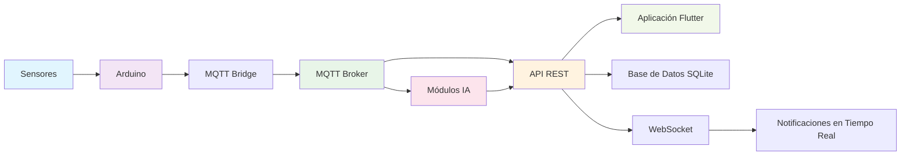
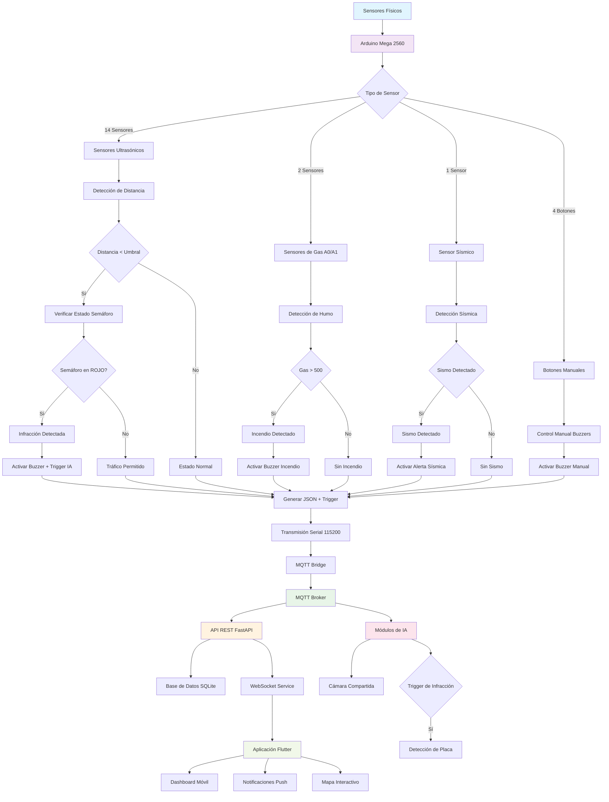
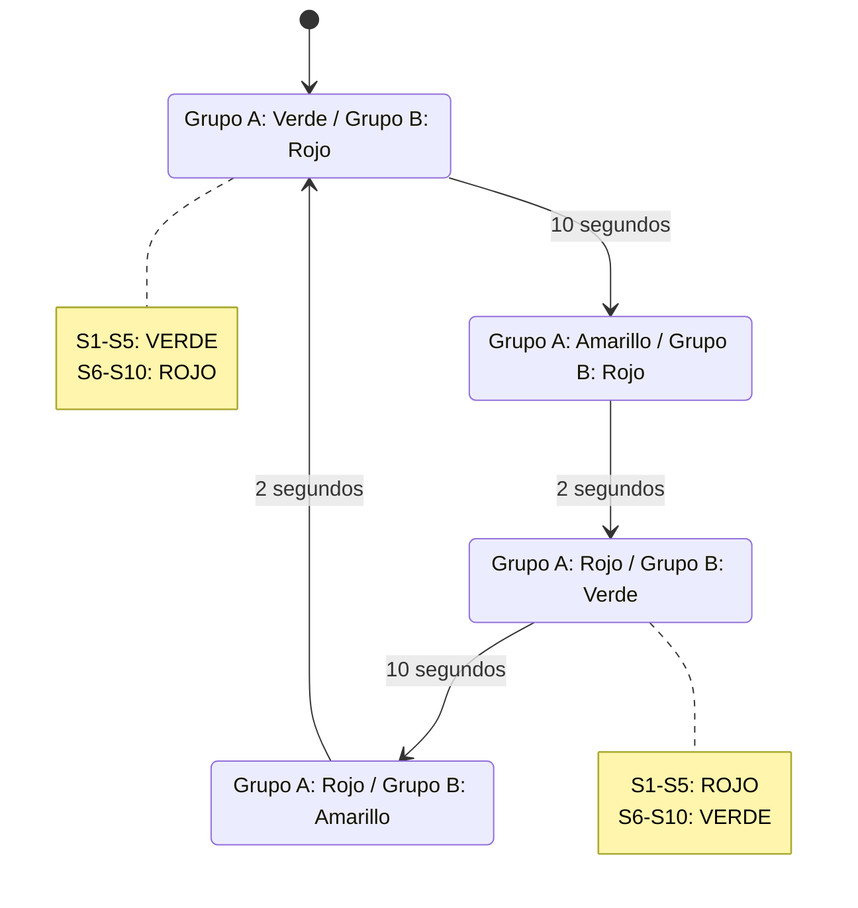
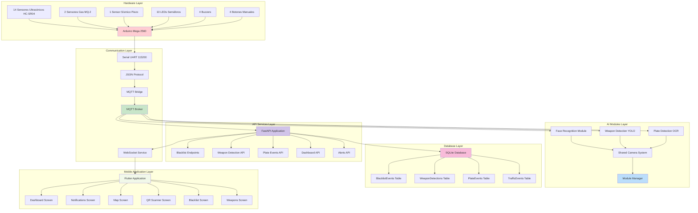
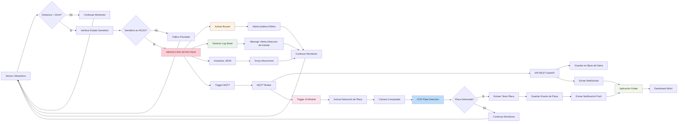
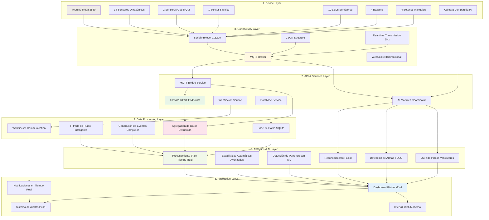
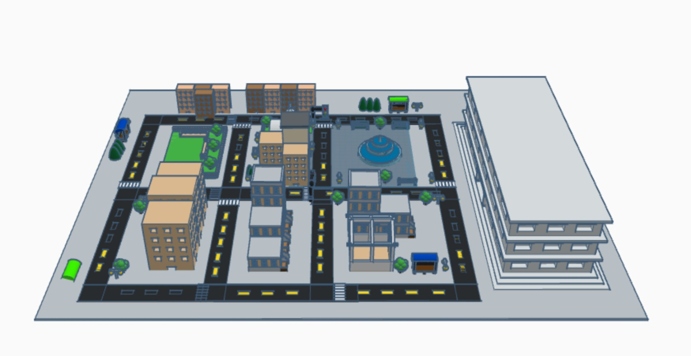
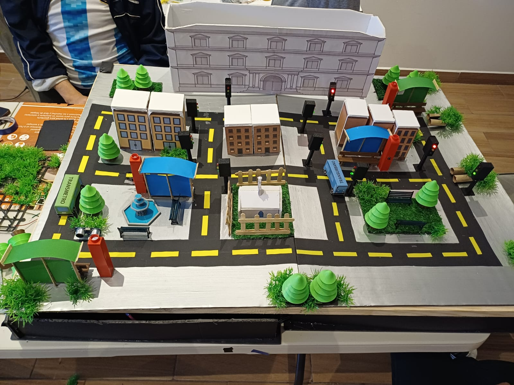
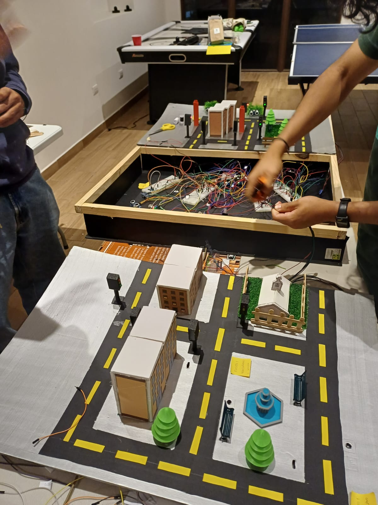
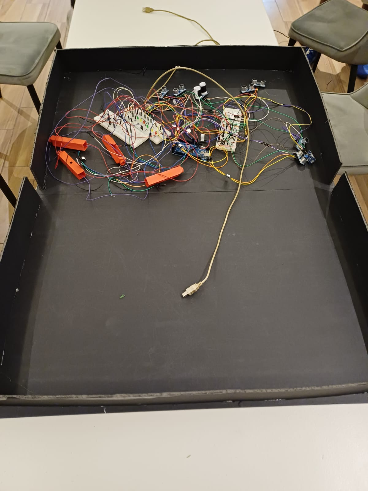

<div style="width: 100%; max-width: 700px; margin: 0 auto; padding: 48px 32px; font-family: 'Times New Roman', Times, serif;">
  <div style="text-align: center;">
    <h2 style="margin-bottom: 8px;">UNIVERSIDAD DE SAN CARLOS DE GUATEMALA</h2>
    <h3 style="margin-bottom: 8px;">FACULTAD DE INGENIERÍA</h3>
    <h4 style="margin-bottom: 8px;">ESCUELA DE INGENIERÍA DE CIENCIAS Y SISTEMAS</h4>
    <h4 style="margin-bottom: 8px;">LABORATORIO ARQUITECTURA DE COMPUTADORAS Y ENSAMBLADORES 2</h4>
    <h4 style="margin-bottom: 8px;">SECCIÓN B</h4>
    <h4 style="margin-bottom: 8px;">INGENIERO JURGEN RAMIREZ</h4>
    <h4 style="margin-bottom: 24px;">AUXILIAR LUIS LIZAMA</h4>
    <hr style="border: 1px solid #000; margin: 24px 0;">
    <h2 style="margin-bottom: 16px;"><ins>DOCUMENTACIÓN FASE 3</ins></h2>
    <h3 style="margin-bottom: 24px;">GRUPO #4</h3>
    <table style="width: 80%; margin: 0 auto; border-collapse: collapse; font-size: 1.1em;">
      <thead>
        <tr>
          <th style="padding: 8px;">Nombre</th>
          <th style="padding: 8px;">Carnet</th>
        </tr>
      </thead>
      <tbody>
        <tr><td style="padding: 8px;">DAMIAN OROZCO</td><td style="padding: 8px;">202300514</td></tr>
        <tr><td style="padding: 8px;">ESTEBAN TRAMPE</td><td style="padding: 8px;">202300431</td></tr>
        <tr><td style="padding: 8px;">JORGE MEJÍA</td><td style="padding: 8px;">202300376</td></tr>
        <tr><td style="padding: 8px;">FATIMA CEREZO</td><td style="padding: 8px;">202300434</td></tr>
        <tr><td style="padding: 8px;">VALERY ALARCÓN</td><td style="padding: 8px;">202300794</td></tr>
        <tr><td style="padding: 8px;">DIEGO MORALES</td><td style="padding: 8px;">202300449</td></tr>
        <tr><td style="padding: 8px;">JULIO ESCOBAR</td><td style="padding: 8px;">202300825</td></tr>
        <tr><td style="padding: 8px;">MARCOS BARRIOS</td><td style="padding: 8px;">202300396</td></tr>
      </tbody>
    </table>
  </div>
</div>

<div style="page-break-before: always;"></div>


## Introducción
En el contexto de las ciudades inteligentes modernas, la gestión eficiente del tráfico urbano y la seguridad ciudadana representan desafíos críticos que requieren soluciones tecnológicas innovadoras y escalables. Este proyecto desarrolla un *Sistema Integral de Seguridad y Gestión de Tráfico Urbano con Inteligencia Artificial* que implementa una arquitectura distribuida de próxima generación, combinando tecnologías IoT, inteligencia artificial, microservicios y aplicaciones móviles para crear una infraestructura urbana completamente automatizada y conectada.

El sistema evoluciona hacia una arquitectura de microservicios robusta que integra hardware Arduino Mega 2560 con sensores distribuidos, módulos de inteligencia artificial para reconocimiento facial, detección de armas y reconocimiento de placas vehiculares, una API REST desarrollada en FastAPI con base de datos SQLite, un broker MQTT para comunicación en tiempo real, y una aplicación móvil Flutter multiplataforma. Esta solución avanzada permite el monitoreo inteligente en tiempo real, la detección automática de infracciones y amenazas de seguridad, el control predictivo de semáforos, y la supervisión ambiental con capacidades de análisis predictivo.

La propuesta se distingue por su capacidad de procesar múltiples fuentes de datos simultáneamente utilizando inteligencia artificial, generar alertas automáticas inteligentes ante situaciones críticas, proporcionar visualización integral a través de dashboards profesionales, y ofrecer una experiencia de usuario moderna a través de aplicaciones móviles nativas. El proyecto demuestra la aplicación práctica de conceptos avanzados de arquitectura de computadoras, sistemas embebidos, inteligencia artificial, microservicios, comunicación MQTT, y desarrollo de aplicaciones móviles en un entorno de ciudad inteligente de próxima generación.

## Objetivos

### 1. General
Desarrollar e implementar un sistema integral de ciudad inteligente con inteligencia artificial para la gestión automatizada del tráfico urbano y monitoreo avanzado de seguridad ciudadana, utilizando una arquitectura de microservicios distribuidos, tecnologías IoT, módulos de inteligencia artificial, comunicación MQTT, APIs REST, y aplicaciones móviles multiplataforma, que permita optimizar el flujo vehicular, detectar automáticamente infracciones de tráfico y amenazas de seguridad, y proporcionar alertas inteligentes en tiempo real ante situaciones de emergencia.

### 2. Específicos
- *Diseñar y construir una red de sensores distribuidos con capacidades de IA* que permita el monitoreo simultáneo de múltiples puntos críticos de tráfico utilizando sensores ultrasónicos HC-SR04, sensores de gas MQ-2, y sensores sísmicos, con capacidad de detectar presencia vehicular, medir distancias con precisión centimétrica, y identificar violaciones a la señalización vial mediante análisis inteligente de patrones.

- *Implementar módulos de inteligencia artificial especializados* para reconocimiento facial de personas en listas negras, detección automática de armas utilizando modelos YOLO, y reconocimiento de placas vehiculares con OCR avanzado, integrando estos módulos con el hardware Arduino y proporcionando capacidades de análisis predictivo y detección de amenazas en tiempo real.

- *Desarrollar una arquitectura de microservicios robusta* basada en FastAPI con base de datos SQLite, que incluya endpoints REST para gestión de eventos de tráfico, listas negras, detección de armas, y eventos de placas, con capacidades de WebSocket para comunicación en tiempo real y un broker MQTT para distribución eficiente de datos entre componentes del sistema.

- *Crear una aplicación móvil Flutter multiplataforma* con interfaz moderna y diseño profesional, que proporcione dashboards interactivos, notificaciones push en tiempo real, mapas interactivos del estado del tráfico, escáner QR para información turística, y gestión completa del sistema desde dispositivos móviles, ofreciendo una experiencia de usuario nativa en Android e iOS.

- *Implementar un sistema de comunicación distribuida* basado en protocolos MQTT para comunicación en tiempo real entre Arduino, módulos de IA, API REST, y aplicación móvil, con capacidades de serialización JSON, gestión de eventos asíncronos, y distribución eficiente de alertas y notificaciones a través de múltiples canales de comunicación.

## Descripción del Problema 

Las ciudades modernas enfrentan desafíos críticos y complejos en la gestión del tráfico urbano y la seguridad ciudadana que requieren soluciones automatizadas, inteligentes y escalables basadas en tecnologías de próxima generación:

*Problemas de Tráfico Avanzados:*
- Infracciones frecuentes de conductores que cruzan intersecciones en luz roja sin sistemas de identificación automatizada
- Falta de monitoreo inteligente en múltiples puntos de control simultáneamente con capacidades de análisis predictivo
- Ausencia de sistemas de alertas inmediatas e inteligentes ante violaciones de tráfico con identificación de vehículos
- Gestión manual e ineficiente de ciclos semafóricos sin optimización basada en patrones de tráfico
- Carencia de sistemas de reconocimiento de placas vehiculares para seguimiento y control de infracciones

*Problemas de Seguridad Ciudadana:*
- Detección tardía de incendios o emergencias ambientales en espacios urbanos sin sistemas de alerta temprana
- Ausencia de sistemas de reconocimiento facial para identificación de personas en listas negras de seguridad
- Falta de detección automática de armas y objetos peligrosos en espacios públicos
- Carencia de sistemas integrados que combinen múltiples tipos de sensores con inteligencia artificial
- Falta de centralización inteligente de alertas de emergencia en tiempo real con análisis de patrones

*Limitaciones Tecnológicas y Arquitecturales:*
- Sistemas de monitoreo fragmentados que no se comunican entre sí con protocolos modernos
- Interfaces de usuario complejas y obsoletas que dificultan la supervisión integral y la experiencia del usuario
- Altos costos de implementación de soluciones comerciales especializadas sin capacidades de personalización
- Falta de escalabilidad en sistemas monolíticos que no pueden adaptarse a crecimientos urbanos
- Ausencia de aplicaciones móviles nativas para gestión remota y acceso desde cualquier ubicación
- Limitaciones en el procesamiento de datos en tiempo real sin capacidades de análisis predictivo

*Desafíos de Integración y Comunicación:*
- Sistemas aislados que no comparten información entre diferentes servicios municipales
- Protocolos de comunicación obsoletos que no soportan la complejidad de datos modernos
- Falta de APIs modernas y estándares de interoperabilidad entre sistemas
- Ausencia de sistemas de mensajería en tiempo real para notificaciones críticas
- Limitaciones en la visualización de datos complejos y análisis estadísticos avanzados

Este proyecto aborda estas problemáticas mediante un sistema integral de ciudad inteligente con inteligencia artificial que automatiza la detección de infracciones con identificación vehicular, implementa reconocimiento facial y detección de armas, centraliza el monitoreo de seguridad con análisis predictivo, y proporciona una arquitectura de microservicios escalable con aplicación móvil nativa para la gestión urbana inteligente de próxima generación.

## Smart Connected Design Framework

Este proyecto implementa una arquitectura completa del Smart Connected Design Framework de próxima generación, creando un ecosistema IoT robusto, escalable e inteligente con capacidades avanzadas de inteligencia artificial y microservicios.

### Capas Implementadas

#### 1. Dispositivos y Sensores (Device Layer)
- *Hardware:* Arduino Mega 2560 con múltiples sensores y actuadores distribuidos
- *Sensores Ultrasónicos:* 14 sensores HC-SR04 para detectar presencia vehicular y peatonal con precisión centimétrica
- *Sensores de Gas:* 2 sensores analógicos MQ-2 (A0, A1) para detección de humo/incendios
- *Sensores Sísmicos:* 1 sensor piezoeléctrico para detección de actividad sísmica
- *Actuadores:* 10 semáforos LED inteligentes, 4 buzzers para alertas auditivas
- *Interfaces de Usuario:* Botones manuales para control directo de buzzers y emergencias

#### 2. Conectividad (Connectivity Layer)
- *Protocolo Serial:* Comunicación a 115200 baudios entre Arduino y sistema de procesamiento
- *Protocolo MQTT:* Comunicación en tiempo real distribuida entre todos los componentes del sistema
- *Formato de Datos:* JSON estructurado para intercambio de información compleja
- *Transmisión en Tiempo Real:* Envío de datos cada 200ms (5 Hz) con capacidades de QoS
- *WebSocket:* Comunicación bidireccional en tiempo real para notificaciones instantáneas

#### 3. Procesamiento de Datos (Data Processing Layer)
- *Agregación de Datos:* El Arduino procesa múltiples fuentes de sensores con filtrado inteligente
- *Filtrado de Ruido:* Implementación de algoritmos de filtrado Kalman y umbrales dinámicos
- *Generación de Eventos:* Detección automática de infracciones y situaciones de emergencia con análisis de patrones
- *Base de Datos:* Almacenamiento estructurado en SQLite con índices optimizados para consultas rápidas

#### 4. Inteligencia Artificial (AI Layer)
- *Reconocimiento Facial:* Módulo especializado con OpenCV y modelos pre-entrenados para identificación de personas en listas negras
- *Detección de Armas:* Sistema YOLO v8 optimizado para detección de armas y objetos peligrosos en tiempo real
- *Reconocimiento de Placas:* OCR avanzado con procesamiento de imágenes para identificación de placas vehiculares
- *Análisis Predictivo:* Algoritmos de machine learning para predicción de patrones de tráfico y detección de anomalías

#### 5. Análisis y Analytics (Analytics Layer)
- *Procesamiento en Tiempo Real:* APIs REST analizan datos entrantes con capacidades de streaming
- *Estadísticas Automáticas:* Cálculo de métricas avanzadas como promedio de gas, conteo de infracciones, y análisis de tendencias
- *Detección de Patrones:* Identificación de zonas de alta actividad con algoritmos de clustering
- *Dashboards Profesionales:* Visualización avanzada con gráficos interactivos y métricas en tiempo real

#### 6. Aplicaciones y Servicios (Application Layer)
- *API REST:* Servicios web modernos con FastAPI para gestión de eventos, listas negras, y análisis de datos
- *Aplicación Móvil:* App Flutter multiplataforma con interfaz nativa para Android e iOS
- *Dashboard Web:* Interfaz web moderna con capacidades de monitoreo en tiempo real
- *Sistema de Alertas:* Notificaciones push inteligentes con análisis de prioridades y geolocalización
- *Microservicios:* Arquitectura distribuida con servicios especializados para cada funcionalidad

## Arquitectura del Sistema

### Arquitectura Física Distribuida



### Arquitectura de Microservicios

#### Módulo Arduino (Hardware Layer)
- *Gestión de Sensores:* Lectura y procesamiento de 14 sensores ultrasónicos con filtrado inteligente
- *Control de Semáforos:* Lógica temporal avanzada para ciclos de semáforos (verde→amarillo→rojo)
- *Detección de Infracciones:* Monitoreo de violaciones en luz roja con análisis de patrones
- *Sistema de Alertas:* Activación automática de buzzers en emergencias con priorización
- *Comunicación Serial:* Envío de datos estructurados en JSON a 115200 baudios

#### Módulo MQTT Bridge (Communication Layer)
- *Serial Service:* Gestión de comunicación serial con Arduino
- *MQTT Publisher:* Publicación de datos en tiempo real al broker MQTT
- *Data Parser:* Procesamiento y validación de datos JSON
- *Simulator Mode:* Modo de simulación para desarrollo sin hardware

#### Módulos de Inteligencia Artificial (AI Layer)
- *Face Recognition Module:* Reconocimiento facial con OpenCV y modelos pre-entrenados
- *Weapon Detection Module:* Detección de armas usando YOLO v8 optimizado
- *Plate Detection Module:* OCR avanzado para reconocimiento de placas vehiculares
- *Shared Camera:* Sistema de cámara compartida entre módulos de IA
- *Module Manager:* Coordinación y gestión de múltiples módulos de IA

#### API REST (Service Layer)
- *FastAPI Application:* Servidor web moderno con documentación automática
- *Endpoints Especializados:*
  - `/api/v1/blacklist-events` - Gestión de eventos de listas negras
  - `/api/v1/weapon-detections` - Detección de armas y objetos peligrosos
  - `/api/v1/plate-events` - Eventos de reconocimiento de placas
  - `/api/v1/dashboard` - Métricas y estadísticas del sistema
  - `/api/v1/alerts` - Sistema de alertas y notificaciones
- *WebSocket Support:* Comunicación bidireccional en tiempo real
- *Database Integration:* Gestión de base de datos SQLite con ORM

#### Aplicación Flutter (Mobile Layer)
- *Arquitectura Moderna:* Material Design 3 con tema oscuro personalizado
- *Navegación Avanzada:* go_router para navegación declarativa
- *Pantallas Especializadas:*
  - Dashboard profesional con métricas en tiempo real
  - Notificaciones push con gestión de prioridades
  - Mapa interactivo con estado del tráfico
  - Escáner QR para información turística
  - Gestión de listas negras y detección de armas
- *WebSocket Integration:* Comunicación en tiempo real con la API
- *Responsive Design:* Adaptable a diferentes tamaños de pantalla

#### Base de Datos (Data Layer)
- *SQLite Database:* Almacenamiento estructurado y optimizado
- *Tablas Especializadas:*
  - BlacklistEvents - Eventos de reconocimiento facial
  - WeaponDetections - Detecciones de armas
  - PlateEvents - Eventos de placas vehiculares
  - TrafficEvents - Eventos de tráfico general
  - SystemMetrics - Métricas del sistema
- *Índices Optimizados:* Para consultas rápidas en tiempo real
- *Backup Automático:* Sistema de respaldo de datos críticos

## Estructura de Carpetas

```
ARQUI2B_2S2025_GL4/
├── README.md                           # Documentación principal del proyecto
├── requirements.txt                    # Dependencias Python del proyecto
├── activate_env.sh                     # Script de activación del entorno virtual
├── run_simulator.sh                    # Script para ejecutar simulador
├── test_full_flow.py                   # Pruebas de integración completa
├── test_mqtt_alert.py                  # Pruebas de alertas MQTT
├── test_websocket_connection.py        # Pruebas de conexión WebSocket
├── simulate_alert.py                   # Simulador de alertas
├── interactive_mqtt_simulator.py       # Simulador interactivo MQTT
├── mosquitto.conf                      # Configuración del broker MQTT
├── mosquitto_local.conf                # Configuración MQTT local
├── railway.json                        # Configuración de despliegue Railway
├── railway-mosquitto.json              # Configuración MQTT Railway
├── start_mosquitto.sh                  # Script de inicio del broker MQTT
├── start_mos2.sh                       # Script alternativo de inicio
│
├── arduino/                            # Hardware y firmware Arduino
│   ├── main/
│   │   └── main.ino                   # Firmware principal del Arduino
│   ├── sketch_ciudad_con_sismo/
│   │   └── sketch_ciudad_con_sismo.ino # Firmware con detección sísmica
│   ├── sketch_ciudad_con_mq02/
│   │   └── sketch_ciudad_con_mq02.ino  # Firmware con sensores MQ-2
│   └── pruebas_hcsr04.pdsprj          # Proyecto de pruebas de sensores
│
├── api/                               # API REST con FastAPI
│   ├── app/
│   │   ├── main.py                    # Punto de entrada de la API
│   │   ├── api/
│   │   │   ├── dependencies.py        # Dependencias de la API
│   │   │   └── endpoints/             # Endpoints especializados
│   │   │       ├── health.py          # Endpoints de salud del sistema
│   │   │       ├── alerts.py          # Gestión de alertas
│   │   │       ├── websockets.py      # Comunicación WebSocket
│   │   │       ├── dashboard.py       # Métricas del dashboard
│   │   │       ├── blacklist.py       # Gestión de listas negras
│   │   │       ├── weapon.py          # Detección de armas
│   │   │       └── plate_events.py    # Eventos de placas
│   │   ├── core/
│   │   │   ├── config.py              # Configuración del sistema
│   │   │   └── logging.py             # Sistema de logging
│   │   ├── db/
│   │   │   ├── connection.py          # Conexión a base de datos
│   │   │   └── repositories/          # Repositorios de datos
│   │   ├── schemas/                   # Esquemas de datos
│   │   │   ├── blacklist_schemas.py   # Esquemas de listas negras
│   │   │   ├── plate_schemas.py       # Esquemas de placas
│   │   │   └── weapon_schemas.py      # Esquemas de armas
│   │   └── services/                  # Servicios de la aplicación
│   │       ├── mqtt_service.py        # Servicio MQTT
│   │       └── websocket_service.py   # Servicio WebSocket
│   ├── init_database.py               # Inicialización de la base de datos
│   ├── run.py                         # Script de ejecución
│   └── requirements.txt               # Dependencias de la API
│
├── mqtt/                             # Bridge MQTT Arduino
│   ├── app/
│   │   ├── main.py                   # Punto de entrada del bridge
│   │   ├── core/                     # Configuración y logging
│   │   ├── models/                   # Modelos de datos
│   │   ├── parsers/                  # Parsers de datos Arduino
│   │   └── services/                 # Servicios del bridge
│   ├── run.py                        # Script de ejecución
│   └── requirements.txt              # Dependencias del bridge
│
├── ia_modules/                       # Módulos de Inteligencia Artificial
│   ├── core/                         # Núcleo del sistema de IA
│   │   ├── camera.py                 # Gestión de cámara compartida
│   │   ├── module_base.py            # Clase base para módulos
│   │   ├── module_manager.py         # Gestor de módulos
│   │   └── trigger_state.py          # Estado de triggers
│   ├── modules/                      # Módulos especializados
│   │   ├── face_recognition.py       # Reconocimiento facial
│   │   ├── plate_detection.py        # Detección de placas
│   │   └── weapon_detection.py       # Detección de armas
│   ├── models/                       # Modelos de IA pre-entrenados
│   │   └── weapons/
│   │       └── best.pt               # Modelo YOLO para armas
│   ├── run.py                        # Punto de entrada de IA
│   ├── requirements-ia.txt           # Dependencias de IA
│   └── yolov8n.pt                    # Modelo YOLO base
│
├── app_flutter/                      # Aplicación móvil Flutter
│   ├── lib/                          # Código fuente Dart
│   │   ├── main.dart                 # Punto de entrada de la app
│   │   ├── config/                   # Configuración de la app
│   │   ├── layouts/                  # Layouts de la aplicación
│   │   ├── models/                   # Modelos de datos
│   │   ├── routes/                   # Configuración de rutas
│   │   ├── screens/                  # Pantallas de la aplicación
│   │   ├── services/                 # Servicios y APIs
│   │   ├── utils/                    # Utilidades
│   │   └── widgets/                  # Widgets personalizados
│   ├── assets/                       # Recursos de la aplicación
│   │   ├── gallery/                  # Galería de imágenes para IA
│   │   └── *.svg, *.jpg              # Iconos y recursos
│   ├── android/                      # Configuración Android
│   ├── ios/                          # Configuración iOS
│   ├── pubspec.yaml                  # Configuración del proyecto Flutter
│   └── README.md                     # Documentación de la app
│
├── documentation/                    # Documentación del proyecto
│   ├── fase 1/                      # Documentación de la Fase 1
│   └── fase 3/                      # Documentación de la Fase 3 (actual)
│
├── events/                           # Eventos capturados por el sistema
├── infra/                            # Infraestructura y despliegue
│   └── grafana/                      # Dashboards de Grafana
└── SQL/                              # Scripts de base de datos
    └── DB_ARQUI2_SQLite.sql          # Esquema de la base de datos
```

## Diagramas de Flujo

### Flujo Principal del Sistema Fase 3



### Flujo de Control de Semáforos



### Arquitectura de Componentes Fase 3



### Flujo de Detección de Infracciones con IA



### Flujo de Smart Connected Design Framework Fase 3



## Configuración de Hardware

### Sensores Ultrasónicos (14 unidades)
- *TM1, TM2:* Paradas Transmetro (pines 22-25)
- *TU1-TU7:* Red Transurbano (pines 26-35, algunos anulados)
- *TV2-TV7:* Red TV (pines 46-53, distribuidos)

### Sensores de Gas
- *A0:* Zona 1 de detección de humo
- *A1:* Zona 2 de detección de humo
- *Umbral:* 500 (escala 0-1023)

### Sistema de Semáforos
- *Grupo A:* Semáforos S1-S5 (pines 40-42)
- *Grupo B:* Semáforos S6-S10 (pines 43-45)
- *Temporización:* Verde 10s, Amarillo 2s

### Sistema de Alertas
- *Buzzer 1:* Pin 36 (control por TU1, botón D38)
- *Buzzer 2:* Pin 37 (control por TU2, botón D39)
- *Buzzer 3:* Pin 2 (control por incendio A0, botón D4)
- *Buzzer 4:* Pin 3 (control por incendio A1, botón D5)

## Funcionalidades del Sistema

### Monitoreo en Tiempo Real
- Estado de 10 semáforos simultáneos
- Distancias de 6 paradas críticas
- Niveles de gas en 3 zonas
- Estados de pánico por zona

### Detección Automática
- *Infracciones de Tráfico:* Cruce en luz roja
- *Incendios:* Detección por umbral de humo
- *Presencia Vehicular:* Detección ultrasónica
- *Eventos de Pánico:* Activación manual/automática

### Sistema de Alertas
- *Visuales:* Cambio de colores en interfaz
- *Auditivas:* Activación automática de buzzers
- *Registro:* Log de eventos con timestamp

## Compilación y Ejecución

### Firmware Arduino
1. Abrir arduino/main.ino en Arduino IDE
2. Configurar board: Arduino Mega 2560
3. Seleccionar puerto serial correspondiente
4. Compilar y cargar

### Interfaz Processing
bash
cd ui
processing-java --sketch=. --run


### Configuración Serial
- *Velocidad:* 115200 baudios
- *Formato:* 8N1 (8 bits, sin paridad, 1 bit stop)
- *Control de Flujo:* Ninguno

## Extensibilidad

### Agregar Nuevos Sensores
1. Definir pines en array US_PINS
2. Agregar lógica en función readUltrasonicCm()
3. Incluir en JSON de salida
4. Actualizar interfaz Processing

### Nuevas Pantallas UI
1. Crear clase heredando de Screen
2. Implementar método renderContent()
3. Registrar en ScreenManager
4. Agregar elemento en SideBar

### Protocolos Adicionales
- Preparado para WiFi/Ethernet
- Estructura JSON extensible
- Interfaz modular para nuevos protocolos

## Casos de Uso

### Gestión de Tráfico
- Monitoreo de flujo vehicular
- Detección automática de infracciones
- Optimización de tiempos de semáforo

### Seguridad Urbana
- Detección temprana de incendios
- Sistema de alertas en tiempo real
- Monitoreo de zonas críticas

### Análisis de Datos
- Estadísticas de tráfico
- Patrones de comportamiento
- Reportes de incidencias

## Tecnologías Utilizadas

### Hardware y Sensores
- *Microcontrolador:* Arduino Mega 2560 con 256KB Flash y 8KB SRAM
- *Sensores Ultrasónicos:* 14 unidades HC-SR04 para detección de distancia (2cm-400cm)
- *Sensores de Gas:* 2 unidades MQ-2 para detección de humo e incendios
- *Sensores Sísmicos:* 1 sensor piezoeléctrico para detección de actividad sísmica
- *Actuadores:* 10 LEDs para semáforos, 4 buzzers para alertas auditivas
- *Interfaces:* 4 botones manuales para control de emergencias
- *Cámara:* Webcam USB para módulos de inteligencia artificial

### Software y Frameworks
- *Desarrollo Hardware:* Arduino IDE con librerías personalizadas
- *API REST:* FastAPI con Python 3.9+ y documentación automática
- *Base de Datos:* SQLite con índices optimizados para consultas en tiempo real
- *Aplicación Móvil:* Flutter 3.9+ con Dart para desarrollo multiplataforma
- *Inteligencia Artificial:* OpenCV, YOLO v8, EasyOCR para procesamiento de imágenes
- *Comunicación:* Protocolos MQTT, WebSocket, Serial UART
- *Arquitectura:* Microservicios distribuidos con Smart Connected Design Framework

### Librerías y Dependencias Python
- *FastAPI:* Framework web moderno para APIs REST
- *Paho-MQTT:* Cliente MQTT para comunicación en tiempo real
- *OpenCV:* Procesamiento de imágenes y visión por computadora
- *Ultralytics:* Modelos YOLO para detección de objetos
- *EasyOCR:* Reconocimiento óptico de caracteres
- *SQLAlchemy:* ORM para gestión de base de datos
- *WebSockets:* Comunicación bidireccional en tiempo real
- *Pydantic:* Validación de datos y esquemas
- *Uvicorn:* Servidor ASGI de alto rendimiento

### Tecnologías Flutter
- *Framework:* Flutter 3.9+ con Dart SDK
- *Navegación:* go_router para navegación declarativa
- *Estado:* Provider para gestión de estado
- *Comunicación:* web_socket_channel para WebSocket
- *UI:* Material Design 3 con tema personalizado
- *Gráficos:* fl_chart para visualización de datos
- *Cámara:* mobile_scanner para códigos QR
- *HTTP:* http para comunicación con APIs REST
- *Permisos:* permission_handler para gestión de permisos

### Infraestructura y Despliegue
- *Broker MQTT:* Mosquitto con configuración personalizada
- *Contenedores:* Docker para despliegue de servicios
- *Monitoreo:* Grafana para dashboards de métricas
- *Versionado:* Git con control de versiones distribuido
- *Documentación:* Markdown con diagramas Mermaid
- *Testing:* Scripts de prueba automatizados para integración

### Patrones de Diseño Implementados
- *Microservicios:* Arquitectura distribuida con servicios especializados
- *Repository Pattern:* Abstracción de acceso a datos
- *Observer Pattern:* Notificaciones en tiempo real
- *Factory Pattern:* Creación de módulos de IA
- *Strategy Pattern:* Múltiples algoritmos de detección
- *Singleton Pattern:* Gestión de recursos compartidos
- *Builder Pattern:* Construcción de mensajes MQTT

Este sistema representa una implementación completa del paradigma de ciudad inteligente de próxima generación, integrando hardware embebido, inteligencia artificial, microservicios, comunicación distribuida, y aplicaciones móviles nativas en una solución cohesiva y escalable para gestión urbana inteligente.

## Prototipo
### Sistema Integral de Ciudad Inteligente con IA

El prototipo desarrollado evoluciona hacia un *sistema integral de ciudad inteligente con inteligencia artificial* que simula un entorno urbano completo con infraestructura de transporte, seguridad avanzada, y servicios públicos integrados con capacidades de IA. Esta maqueta física representa una implementación escalable del sistema IoT de próxima generación con microservicios y aplicaciones móviles.

#### Características del Modelo Fase 3

*Infraestructura Urbana Inteligente:*
- *6 cuadras urbanas* distribuidas estratégicamente para simular una ciudad compacta con conectividad IoT
- *10 semáforos inteligentes* ubicados en intersecciones críticas con control predictivo y detección automática de infracciones
- *Edificios, parques y fuentes* que recrean el ambiente de una ciudad real con puntos de acceso a servicios digitales
- *1 iglesia* como punto de referencia arquitectónico y cultural con sistema de reconocimiento facial
- *1 centro histórico* representando la zona patrimonial con cámaras de monitoreo inteligente

*Sistema de Transporte Público Avanzado:*
- *4 paradas de buses inteligentes* distribuidas en puntos estratégicos con sistemas de reconocimiento de placas
- *2 paradas de Transmetro* que forman parte del sistema de transporte masivo con monitoreo en tiempo real
- *2 paradas de Transurbano* integradas al sistema de movilidad urbana con detección automática de vehículos

*Rutas de Transporte con IA:*
- *Transmetro:* Realiza un recorrido circular completo con detección automática de infracciones y reconocimiento de placas vehiculares
- *Transurbano:* Opera en una calle principal con sistema de monitoreo inteligente y análisis de patrones de tráfico

*Sistemas de Seguridad y Monitoreo con IA:*
- *4 botones de pánico inteligentes* distribuidos en zonas de alta afluencia con integración a sistema de alertas móviles
- *2 sensores de incendio avanzados* ubicados en áreas críticas con análisis predictivo de riesgos
- *1 sensor de sismos* instalado para monitoreo de actividad sísmica con alertas automáticas
- *Sistema de cámaras inteligentes* para reconocimiento facial, detección de armas, y monitoreo de seguridad

*Integración Tecnológica Avanzada:*
El modelo 3D no solo es una representación física, sino que integra todos los componentes del ecosistema tecnológico de próxima generación, permitiendo la demostración en tiempo real de:

**Capacidades de Hardware:**
- Detección automática de infracciones de tráfico con análisis de patrones
- Monitoreo ambiental continuo con predicción de riesgos
- Sistema de alertas de emergencia con notificaciones push
- Control inteligente de semáforos con optimización dinámica

**Capacidades de Inteligencia Artificial:**
- Reconocimiento facial en tiempo real para identificación de personas en listas negras
- Detección automática de armas y objetos peligrosos usando modelos YOLO
- Reconocimiento de placas vehiculares con OCR avanzado para seguimiento de infracciones
- Análisis predictivo de patrones de tráfico y detección de anomalías

**Capacidades de Software:**
- API REST con microservicios especializados para cada funcionalidad
- Base de datos SQLite con análisis en tiempo real y reportes automáticos
- Comunicación MQTT distribuida entre todos los componentes del sistema
- Aplicación móvil Flutter con dashboard profesional y notificaciones push

**Capacidades de Integración:**
- WebSocket para comunicación bidireccional en tiempo real
- Sistema de triggers automáticos que activan módulos de IA ante eventos específicos
- Gestión centralizada desde aplicación móvil con acceso remoto
- Monitoreo distribuido con métricas en tiempo real y alertas inteligentes

Esta maqueta representa una *ciudad inteligente funcional de próxima generación* que demuestra la aplicabilidad práctica de tecnologías IoT, inteligencia artificial, microservicios, y aplicaciones móviles en la gestión urbana moderna, sirviendo como prototipo escalable para implementaciones reales en entornos metropolitanos con capacidades avanzadas de automatización y análisis predictivo.

### Bocetos

A continuación se presentan los bocetos y modelos 3D del sistema desarrollado:

#### Boceto 1: Diseño General del Sistema



#### Boceto 2: Posicion de Componentes


## Armado Fisico De Maqueta y Conexiones 
#### Trabajo fisico elaborado por todos los integrantes del grupo 






## Registro De Aportes Semanales 

### Semana 1 - Planificación y Organización

<table style="width:100%; border-collapse:collapse;">
  <thead style="background:#736360;">
    <tr>
      <th style="border:1px solid #ccc; padding:8px; text-align:left;">Estudiante</th>
      <th style="border:1px solid #ccc; padding:8px; text-align:left;">Rol Asignado</th>
      <th style="border:1px solid #ccc; padding:8px; text-align:left;">Aporte Semana 1</th>
    </tr>
  </thead>
  <tbody>
    <tr><td style="border:1px solid #ccc; padding:8px;">Julio Escobar</td><td style="border:1px solid #ccc; padding:8px;">Backend & BD (Raspberry Pi)</td><td style="border:1px solid #ccc; padding:8px;">Planificación de arquitectura de microservicios, investigación de FastAPI y SQLite</td></tr>
    <tr><td style="border:1px solid #ccc; padding:8px;">Diego Morales</td><td style="border:1px solid #ccc; padding:8px;">Arduino & Firmware</td><td style="border:1px solid #ccc; padding:8px;">Análisis de código Arduino existente, planificación de mejoras para buzzer y comandos serial</td></tr>
    <tr><td style="border:1px solid #ccc; padding:8px;">Damián Orozco</td><td style="border:1px solid #ccc; padding:8px;">IA Detección de Placas</td><td style="border:1px solid #ccc; padding:8px;">Investigación de OCR y modelos de reconocimiento de placas vehiculares</td></tr>
    <tr><td style="border:1px solid #ccc; padding:8px;">Jorge Mejía</td><td style="border:1px solid #ccc; padding:8px;">IA Reconocimiento Facial</td><td style="border:1px solid #ccc; padding:8px;">Investigación de OpenCV y sistemas de reconocimiento facial, diseño de lista negra</td></tr>
    <tr><td style="border:1px solid #ccc; padding:8px;">Esteban Trampe</td><td style="border:1px solid #ccc; padding:8px;">IA Detección de Armas</td><td style="border:1px solid #ccc; padding:8px;">Investigación de YOLO v8 y modelos de detección de objetos peligrosos</td></tr>
    <tr><td style="border:1px solid #ccc; padding:8px;">Marcos Barrios</td><td style="border:1px solid #ccc; padding:8px;">Flutter Mobile App</td><td style="border:1px solid #ccc; padding:8px;">Planificación de interfaz móvil, investigación de Flutter y diseño de pantallas</td></tr>
    <tr><td style="border:1px solid #ccc; padding:8px;">Fátima Cerezo</td><td style="border:1px solid #ccc; padding:8px;">Grafana & Monitoreo</td><td style="border:1px solid #ccc; padding:8px;">Investigación de Grafana, planificación de dashboards y métricas del sistema</td></tr>
    <tr><td style="border:1px solid #ccc; padding:8px;">Valery Alarcón</td><td style="border:1px solid #ccc; padding:8px;">Pruebas, Documentación & Comunicación Serial</td><td style="border:1px solid #ccc; padding:8px;">Planificación de estrategia de pruebas, diseño de casos de prueba y documentación</td></tr>
  </tbody>
</table>

### Semana 2 - Investigación y Aprendizaje

<table style="width:100%; border-collapse:collapse;">
  <thead style="background:#736360;">
    <tr>
      <th style="border:1px solid #ccc; padding:8px; text-align:left;">Estudiante</th>
      <th style="border:1px solid #ccc; padding:8px; text-align:left;">Rol Asignado</th>
      <th style="border:1px solid #ccc; padding:8px; text-align:left;">Aporte Semana 2</th>
    </tr>
  </thead>
  <tbody>
    <tr><td style="border:1px solid #ccc; padding:8px;">Julio Escobar</td><td style="border:1px solid #ccc; padding:8px;">Backend & BD (Raspberry Pi)</td><td style="border:1px solid #ccc; padding:8px;">Configuración inicial de FastAPI, diseño de endpoints para listas negras, armas y placas</td></tr>
    <tr><td style="border:1px solid #ccc; padding:8px;">Diego Morales</td><td style="border:1px solid #ccc; padding:8px;">Arduino & Firmware</td><td style="border:1px solid #ccc; padding:8px;">Adaptación del código Arduino para nuevos comandos de alertas y configuración de buzzer</td></tr>
    <tr><td style="border:1px solid #ccc; padding:8px;">Damián Orozco</td><td style="border:1px solid #ccc; padding:8px;">IA Detección de Placas</td><td style="border:1px solid #ccc; padding:8px;">Implementación inicial de EasyOCR, configuración de cámara para captura de placas</td></tr>
    <tr><td style="border:1px solid #ccc; padding:8px;">Jorge Mejía</td><td style="border:1px solid #ccc; padding:8px;">IA Reconocimiento Facial</td><td style="border:1px solid #ccc; padding:8px;">Configuración de OpenCV, creación de galería de rostros y sistema de lista negra</td></tr>
    <tr><td style="border:1px solid #ccc; padding:8px;">Esteban Trampe</td><td style="border:1px solid #ccc; padding:8px;">IA Detección de Armas</td><td style="border:1px solid #ccc; padding:8px;">Configuración de YOLO v8, entrenamiento de modelo para detección de armas</td></tr>
    <tr><td style="border:1px solid #ccc; padding:8px;">Marcos Barrios</td><td style="border:1px solid #ccc; padding:8px;">Flutter Mobile App</td><td style="border:1px solid #ccc; padding:8px;">Desarrollo de pantallas base para lista negra, armas y placas en Flutter</td></tr>
    <tr><td style="border:1px solid #ccc; padding:8px;">Fátima Cerezo</td><td style="border:1px solid #ccc; padding:8px;">Grafana & Monitoreo</td><td style="border:1px solid #ccc; padding:8px;">Configuración de Grafana, diseño de dashboards para métricas del sistema</td></tr>
    <tr><td style="border:1px solid #ccc; padding:8px;">Valery Alarcón</td><td style="border:1px solid #ccc; padding:8px;">Pruebas, Documentación & Comunicación Serial</td><td style="border:1px solid #ccc; padding:8px;">Desarrollo de scripts de prueba, documentación de APIs y comunicación serial</td></tr>
  </tbody>
</table>

### Semana 3 - Implementación y Desarrollo

<table style="width:100%; border-collapse:collapse;">
  <thead style="background:#736360;">
    <tr>
      <th style="border:1px solid #ccc; padding:8px; text-align:left;">Estudiante</th>
      <th style="border:1px solid #ccc; padding:8px; text-align:left;">Rol Asignado</th>
      <th style="border:1px solid #ccc; padding:8px; text-align:left;">Aporte Semana 3</th>
    </tr>
  </thead>
  <tbody>
    <tr><td style="border:1px solid #ccc; padding:8px;">Julio Escobar</td><td style="border:1px solid #ccc; padding:8px;">Backend & BD (Raspberry Pi)</td><td style="border:1px solid #ccc; padding:8px;">Implementación completa de API REST, configuración de base de datos SQLite con nuevas tablas</td></tr>
    <tr><td style="border:1px solid #ccc; padding:8px;">Diego Morales</td><td style="border:1px solid #ccc; padding:8px;">Arduino & Firmware</td><td style="border:1px solid #ccc; padding:8px;">Finalización del firmware Arduino con detección de infracciones y comandos de alerta</td></tr>
    <tr><td style="border:1px solid #ccc; padding:8px;">Damián Orozco</td><td style="border:1px solid #ccc; padding:8px;">IA Detección de Placas</td><td style="border:1px solid #ccc; padding:8px;">Implementación completa del módulo OCR, integración con sistema de triggers automáticos</td></tr>
    <tr><td style="border:1px solid #ccc; padding:8px;">Jorge Mejía</td><td style="border:1px solid #ccc; padding:8px;">IA Reconocimiento Facial</td><td style="border:1px solid #ccc; padding:8px;">Implementación del módulo de reconocimiento facial con lista negra funcional</td></tr>
    <tr><td style="border:1px solid #ccc; padding:8px;">Esteban Trampe</td><td style="border:1px solid #ccc; padding:8px;">IA Detección de Armas</td><td style="border:1px solid #ccc; padding:8px;">Implementación del módulo YOLO para detección de armas, integración con alertas</td></tr>
    <tr><td style="border:1px solid #ccc; padding:8px;">Marcos Barrios</td><td style="border:1px solid #ccc; padding:8px;">Flutter Mobile App</td><td style="border:1px solid #ccc; padding:8px;">Desarrollo completo de interfaz móvil con dashboards, notificaciones y gestión de datos</td></tr>
    <tr><td style="border:1px solid #ccc; padding:8px;">Fátima Cerezo</td><td style="border:1px solid #ccc; padding:8px;">Grafana & Monitoreo</td><td style="border:1px solid #ccc; padding:8px;">Implementación de dashboards Grafana con métricas en tiempo real del sistema</td></tr>
    <tr><td style="border:1px solid #ccc; padding:8px;">Valery Alarcón</td><td style="border:1px solid #ccc; padding:8px;">Pruebas, Documentación & Comunicación Serial</td><td style="border:1px solid #ccc; padding:8px;">Ejecución de pruebas de integración, documentación completa del sistema y APIs</td></tr>
  </tbody>
</table>

### Semana 4 - Integración y Pruebas Finales

<table style="width:100%; border-collapse:collapse;">
  <thead style="background:#736360;">
    <tr>
      <th style="border:1px solid #ccc; padding:8px; text-align:left;">Estudiante</th>
      <th style="border:1px solid #ccc; padding:8px; text-align:left;">Rol Asignado</th>
      <th style="border:1px solid #ccc; padding:8px; text-align:left;">Aporte Semana 4</th>
    </tr>
  </thead>
  <tbody>
    <tr><td style="border:1px solid #ccc; padding:8px;">Julio Escobar</td><td style="border:1px solid #ccc; padding:8px;">Backend & BD (Raspberry Pi)</td><td style="border:1px solid #ccc; padding:8px;">Optimización de API REST, configuración de MQTT broker, integración final de microservicios</td></tr>
    <tr><td style="border:1px solid #ccc; padding:8px;">Diego Morales</td><td style="border:1px solid #ccc; padding:8px;">Arduino & Firmware</td><td style="border:1px solid #ccc; padding:8px;">Integración final con MQTT, pruebas de comunicación serial, optimización del firmware</td></tr>
    <tr><td style="border:1px solid #ccc; padding:8px;">Damián Orozco</td><td style="border:1px solid #ccc; padding:8px;">IA Detección de Placas</td><td style="border:1px solid #ccc; padding:8px;">Documentación con imágenes y videos del módulo OCR, pruebas de precisión de detección</td></tr>
    <tr><td style="border:1px solid #ccc; padding:8px;">Jorge Mejía</td><td style="border:1px solid #ccc; padding:8px;">IA Reconocimiento Facial</td><td style="border:1px solid #ccc; padding:8px;">Optimización del reconocimiento facial, pruebas con diferentes condiciones de iluminación</td></tr>
    <tr><td style="border:1px solid #ccc; padding:8px;">Esteban Trampe</td><td style="border:1px solid #ccc; padding:8px;">IA Detección de Armas</td><td style="border:1px solid #ccc; padding:8px;">Refinamiento del modelo YOLO, integración con sistema de alertas y comunicación serial</td></tr>
    <tr><td style="border:1px solid #ccc; padding:8px;">Marcos Barrios</td><td style="border:1px solid #ccc; padding:8px;">Flutter Mobile App</td><td style="border:1px solid #ccc; padding:8px;">Mejoras finales de UI/UX, integración con WebSocket, pruebas en dispositivos móviles</td></tr>
    <tr><td style="border:1px solid #ccc; padding:8px;">Fátima Cerezo</td><td style="border:1px solid #ccc; padding:8px;">Grafana & Monitoreo</td><td style="border:1px solid #ccc; padding:8px;">Configuración final de métricas, alertas automáticas y monitoreo del sistema completo</td></tr>
    <tr><td style="border:1px solid #ccc; padding:8px;">Valery Alarcón</td><td style="border:1px solid #ccc; padding:8px;">Pruebas, Documentación & Comunicación Serial</td><td style="border:1px solid #ccc; padding:8px;">Pruebas de sistema completo, documentación final, preparación de demostración</td></tr>
  </tbody>
</table>

## Costo Total

| Componente | Precio Total (Q) |
|------------|----------|
| Arduino Mega 2560 | 350.00 |
| Sensores y Componentes| 495,25 |
| Maqueta | 559.00 |
| Cable y Jumpers| 270.00 |
| Impresiones 3D | 314.45 |
| *TOTAL* | *Q 1,988.70* |

## Conclusiones

El desarrollo de este *Sistema Integral de Ciudad Inteligente con Inteligencia Artificial* ha representado una experiencia académica y técnica transformadora que nos ha permitido aplicar conceptos avanzados de arquitectura de computadoras, sistemas embebidos, inteligencia artificial, microservicios, y desarrollo de aplicaciones móviles en un contexto práctico y realista de próxima generación.

### Evolución Tecnológica y Aprendizaje Avanzado

La implementación de este proyecto evolucionó desde un sistema IoT básico hacia una *arquitectura de microservicios distribuidos con inteligencia artificial*, brindándonos la oportunidad de dominar tecnologías que son fundamentales en el paradigma de las ciudades inteligentes de próxima generación. El trabajo con el *Smart Connected Design Framework expandido* nos permitió comprender la complejidad de los sistemas IoT multicapa avanzados, desde la gestión de sensores hasta la implementación de módulos de IA, APIs REST, y aplicaciones móviles nativas.

### Dominio de Tecnologías Emergentes

La integración exitosa de *Arduino con FastAPI, MQTT, módulos de IA, y Flutter* mediante comunicación distribuida nos introdujo a protocolos y arquitecturas de comunicación modernas que son esenciales en aplicaciones industriales y urbanas de próxima generación. El desarrollo de módulos especializados de reconocimiento facial, detección de armas con YOLO, y OCR de placas vehiculares nos proporcionó experiencia práctica en inteligencia artificial aplicada a problemas reales de seguridad urbana.

### Desafíos Técnicos Avanzados Enfrentados

Uno de los principales retos durante el desarrollo fue la *integración de múltiples tecnologías heterogéneas* en un sistema cohesivo y escalable. La coordinación entre hardware embebido, módulos de IA, APIs REST, broker MQTT, base de datos, y aplicación móvil requirió la implementación de patrones de diseño avanzados, gestión de estado distribuida, y protocolos de comunicación robustos. Esta experiencia nos enseñó la importancia de la arquitectura de microservicios, la gestión de dependencias, y la validación de datos en sistemas distribuidos complejos.

### Innovación en Inteligencia Artificial

La implementación de *módulos de IA especializados* representó un desafío técnico significativo que nos permitió explorar tecnologías emergentes como OpenCV, YOLO v8, y EasyOCR. El desarrollo de un sistema de cámara compartida entre múltiples módulos de IA, la implementación de triggers automáticos para detección de placas ante infracciones, y la integración de reconocimiento facial en tiempo real nos proporcionó experiencia práctica en visión por computadora y machine learning aplicado a problemas de seguridad urbana.

### Arquitectura de Microservicios y Escalabilidad

El diseño e implementación de una *arquitectura de microservicios distribuidos* nos permitió comprender los principios de escalabilidad, mantenibilidad, y robustez en sistemas complejos. La separación de responsabilidades entre el bridge MQTT, la API REST, los módulos de IA, y la aplicación móvil nos enseñó la importancia de la modularidad, la independencia de servicios, y la comunicación asíncrona en sistemas de gran escala.

### Desarrollo de Aplicaciones Móviles Nativas

La creación de una *aplicación Flutter multiplataforma* con interfaz moderna y funcionalidades avanzadas nos introdujo al desarrollo de aplicaciones móviles nativas. La implementación de dashboards profesionales, notificaciones push en tiempo real, mapas interactivos, y escáner QR nos proporcionó experiencia práctica en desarrollo móvil moderno, gestión de estado, y comunicación en tiempo real con servicios backend.

### Importancia del Trabajo Colaborativo Avanzado

La *naturaleza multidisciplinaria y tecnológicamente compleja del proyecto* hizo evidente que su éxito dependía fundamentalmente del trabajo en equipo coordinado y especializado. La integración simultánea de hardware embebido, inteligencia artificial, microservicios, comunicación distribuida, aplicaciones móviles, y documentación técnica requirió la distribución estratégica de responsabilidades entre los ocho integrantes del grupo, cada uno especializándose en diferentes aspectos tecnológicos del sistema.

### Enfoque Realista y Aplicabilidad Industrial

Durante todo el proceso de desarrollo, *priorizamos la creación de una solución realista y escalable* que pudiera implementarse efectivamente en un entorno urbano real con capacidades industriales. Esto se reflejó en la selección de tecnologías estándar de la industria, la implementación de patrones de diseño profesionales, y el desarrollo de una arquitectura distribuida escalable. El sistema resultante no es meramente un prototipo académico, sino una propuesta viable y profesional para la gestión inteligente de infraestructura urbana de próxima generación.

### Impacto Tecnológico y Proyección Futura

El proyecto demuestra exitosamente cómo la *convergencia de múltiples tecnologías emergentes* puede crear soluciones integrales y avanzadas para problemas urbanos complejos. La implementación de detección automática de infracciones con identificación vehicular, reconocimiento facial para seguridad ciudadana, detección de armas para prevención de crímenes, monitoreo ambiental inteligente, y aplicaciones móviles nativas establece las bases para futuras extensiones hacia sistemas más complejos que podrían incluir análisis predictivo avanzado, conectividad 5G, edge computing, y blockchain para seguridad de datos.

